# INTRODUCCIÓN BREVE

En este proyecto configuraremos un entorno de laboratorio compuesto por **Ubuntu Server** como servidor FTP/SFTP y **Windows 11** como cliente. Antes de comenzar con la teoría o las configuraciones, es imprescindible definir las **máquinas virtuales**, sus **recursos mínimos** y la **configuración de red** que permitirá la comunicación entre ambos sistemas.

***

# PASO 0: Preparación de las Máquinas Virtuales

A continuación se detallan los requisitos mínimos y la configuración base de red necesaria para garantizar que el laboratorio funcione correctamente.

## Objetivo del Paso 0

*   Crear dos máquinas virtuales funcionales.
*   Asignar recursos mínimos para Ubuntu Server y Windows 11.
*   Configurar los adaptadores de red en **NAT + Adaptador solo-anfitrión** para permitir:
    *   Acceso a internet.
    *   Comunicación directa entre servidor y cliente.

***

## 1. Máquina Virtual: Ubuntu Server (Servidor FTP/SFTP)

### Requisitos mínimos recomendados

*   **CPU:** 1–2 núcleos
*   **RAM:** 2 GB
*   **Almacenamiento:** 20 GB
*   **SO:** Ubuntu Server LTS (22.04 o 24.04 recomendado)
*   **Red:**
    *   **Adaptador 1:** NAT
    *   **Adaptador 2:** Adaptador solo-anfitrión (Host-Only)

### Explicación de la red

*   **NAT:** permite que Ubuntu Server tenga acceso a internet (actualizaciones, paquetes).
*   **Host-Only:** crea una red privada interna entre el servidor y el cliente Windows 11.

***

## 2. Máquina Virtual: Windows 11 (Cliente FTP/SFTP)

### Requisitos mínimos recomendados

*   **CPU:** 2 núcleos
*   **RAM:** 4 GB
*   **Almacenamiento:** 64 GB
*   **SO:** Windows 11 Pro o Home
*   **Red:**
    *   **Adaptador 1:** NAT
    *   **Adaptador 2:** Adaptador solo-anfitrión (Host-Only)

### Explicación de la red

*   Igual que en Ubuntu:
    *   NAT para acceso a internet.
    *   Host-Only para comunicación directa con el servidor FTP/SFTP.

***

## Notas importantes:
*   El servidor FTP/SFTP se comunicará **solo** por la red Host-Only, evitando exposición innecesaria.
*   Mantén las máquinas actualizadas antes de avanzar.

***

# FASE 2: Verificación de la conectividad entre servidor y cliente

## Introducción

En esta fase comprobamos que Ubuntu Server y Windows 11 pueden comunicarse a través de la red Host-Only configurada en las máquinas virtuales. Esta verificación es necesaria antes de instalar el servicio FTP/SFTP.

## Objetivo

*   Identificar la IP del servidor Ubuntu.
*   Comprobar conectividad desde Windows mediante ping.
*   Validar que la red Host-Only funciona correctamente.

***

## PASO 1 — Comprobar interfaces de red en Ubuntu Server

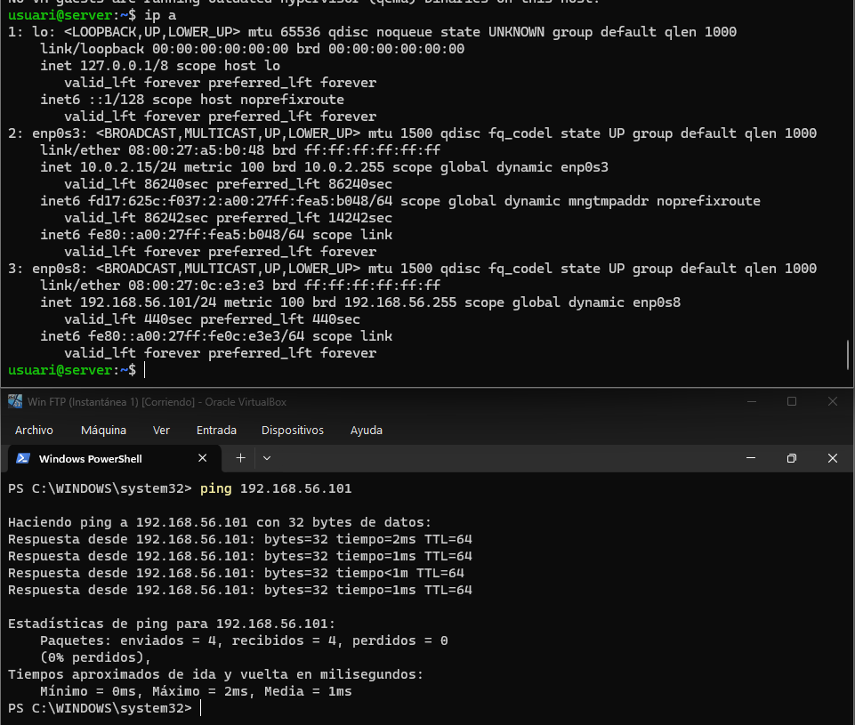

### Comando ejecutado

    ip a

### Explicación del comando

*   **ip**: herramienta moderna para gestionar la red en Linux.
*   **a** (addr): muestra todas las interfaces de red y sus direcciones IP.  
    Sirve para identificar la IP asignada al adaptador Host-Only del servidor (en tu imagen es **192.168.56.101**).

***

## PASO 2 — Verificar conectividad desde Windows 11 hacia Ubuntu Server

### Comando ejecutado (PowerShell)

    ping 192.168.56.101

### Explicación del comando

*   **ping**: herramienta para comprobar si un equipo responde en red.
*   **192.168.56.101**: IP del servidor Ubuntu obtenida en el paso anterior.  
    Permite verificar que ambas máquinas se encuentran en la misma red Host-Only y pueden comunicarse.

***

## Notas importantes

*   Si el ping falla, revisar que ambos adaptadores Host-Only están activados en las dos VM.
*   El adaptador NAT no interviene en esta prueba, solo se usa para acceso a internet.
*   Esta comprobación es obligatoria antes de instalar FTP, ya que el cliente debe alcanzar al servidor.

***

# FASE 3: Instalación y verificación del servicio FTP (vsftpd)

## Introducción

En esta fase instalamos el servidor FTP **vsftpd** en Ubuntu Server y comprobamos que el servicio queda activo y funcionando correctamente.

## Objetivo

*   Instalar el paquete `vsftpd`.
*   Activar el servicio automáticamente.
*   Verificar su estado mediante `systemctl`.

***

## PASO 1 — Instalar el servidor FTP

### Comando ejecutado

    sudo apt install vsftpd -y

### Explicación del comando

*   **sudo**: ejecuta con privilegios de administrador.
*   **apt**: gestor de paquetes del sistema.
*   **install**: instala el paquete indicado.
*   **vsftpd**: servidor FTP que usaremos en esta práctica.
*   **-y**: acepta automáticamente la instalación sin pedir confirmación.

***

## PASO 2 — Comprobar el estado del servicio

### Comando ejecutado

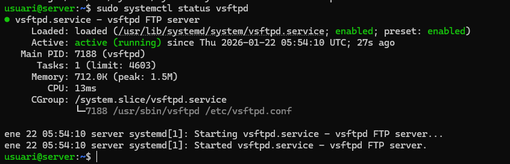

    sudo systemctl status vsftpd

### Explicación del comando

*   **sudo**: necesario para consultar servicios del sistema.
*   **systemctl**: herramienta para gestionar servicios en sistemas con systemd.
*   **status**: muestra el estado actual del servicio.
*   **vsftpd**: servicio correspondiente al servidor FTP.

### Qué indica la salida mostrada en la imagen

*   **active (running)** → el servicio está en ejecución.
*   **enabled** → se iniciará automáticamente al arrancar el sistema.
*   No aparece ningún error → instalación correcta.

***

## Notas importantes

*   Si el servicio aparece como **inactive** o **failed**, revisar `/etc/vsftpd.conf`.
*   vsftpd está instalado, pero aún no configurado; la configuración detallada vendrá en las siguientes fases.
*   Es recomendable mantener el servicio activo para futuras pruebas desde el cliente Windows.

***

# FASE 4: Creación del usuario para acceso FTP

## Introducción

En esta fase se crea un usuario del sistema que posteriormente utilizaremos para autenticarnos en el servidor FTP. Este usuario tendrá su propio directorio personal y contraseña.

## Objetivo

*   Crear un usuario llamado `ftpuser`.
*   Asignarle contraseña.
*   Registrar la información básica del usuario.

***

## PASO 1 — Crear el usuario del sistema

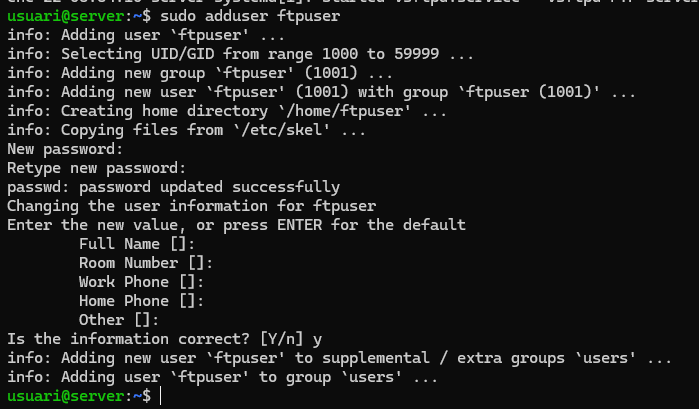

### Comando ejecutado

    sudo adduser ftpuser

### Explicación del comando

*   **sudo**: ejecuta la acción con permisos administrativos.
*   **adduser**: asistente interactivo para crear usuarios en Linux.
*   **ftpuser**: nombre del nuevo usuario que usaremos para las pruebas FTP.

El asistente solicita:

*   Contraseña del usuario.
*   Información adicional (que puedes dejar en blanco).
*   Confirmación final antes de crearlo.

***

## Notas importantes

*   Este usuario podrá iniciar sesión vía FTP cuando vsftpd lo permita mediante configuración.
*   El directorio `/home/ftpuser` se crea automáticamente y será el espacio de trabajo por defecto del usuario.
*   Las opciones adicionales (Full Name, Room Number, etc.) son opcionales.
*   Es recomendable usar una contraseña sencilla en laboratorios, pero nunca en entornos reales.

***

# FASE 5: Preparación del directorio FTP y permisos

## Introducción

En esta fase preparamos la estructura de directorios y permisos necesaria para que el usuario `ftpuser` pueda utilizar el servicio FTP. vsftpd requiere un directorio base protegido y un subdirectorio para las operaciones de lectura/escritura.

## Objetivo

*   Crear el directorio de trabajo `/home/ftpuser/ftp`.
*   Ajustar permisos para cumplir los requisitos de vsftpd.
*   Asignar propiedad correcta al usuario FTP.

***

## PASO 1 — Crear el directorio FTP

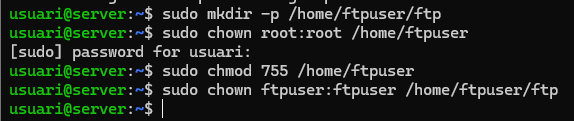

### Comando ejecutado

    sudo mkdir -p /home/ftpuser/ftp

### Explicación del comando

*   **sudo**: permisos de administrador.
*   **mkdir**: crea un directorio.
*   **-p**: crea también cualquier ruta intermedia si no existe.
*   **/home/ftpuser/ftp**: carpeta donde el usuario subirá y descargará archivos.

***

## PASO 2 — Proteger el directorio principal del usuario

### Comando ejecutado

    sudo chown root:root /home/ftpuser

### Explicación del comando

*   **chown**: cambia propietario de un archivo o directorio.
*   **root:root**: propietario y grupo pasan a ser root.
*   **/home/ftpuser**: directorio personal del usuario.  
    vsftpd requiere que el *home* esté protegido para permitir el chroot (jaula FTP).

***

## PASO 3 — Asignar permisos adecuados al directorio principal

### Comando ejecutado

    sudo chmod 755 /home/ftpuser

### Explicación del comando

*   **chmod**: cambia permisos.
*   **755**:
    *   Propietario: lectura/escritura/ejecución.
    *   Grupo y otros: solo lectura y ejecución.
*   Permite que el usuario entre en su home pero sin permiso para modificarlo.

***

## PASO 4 — Asignar propiedad del directorio de trabajo

### Comando ejecutado

    sudo chown ftpuser:ftpuser /home/ftpuser/ftp

### Explicación del comando

*   **ftpuser:ftpuser**: el usuario y grupo propietarias serán `ftpuser`.
*   **/home/ftpuser/ftp**: es el único directorio donde el usuario podrá subir y modificar archivos cuando esté dentro de la jaula FTP.

***

## Notas importantes

*   vsftpd no permite subir archivos al home si no pertenece a root; por eso se protege.
*   El directorio `/home/ftpuser/ftp` es el único modificable por el usuario FTP.
*   Esta estructura es necesaria para activar chroot sin errores de seguridad.

***

# FASE 6: Configuración del servidor FTP (vsftpd.conf)

## Introducción

En esta fase editamos el archivo principal de configuración de **vsftpd** para habilitar el modo pasivo, restringir usuarios, permitir escritura y definir correctamente el entorno del usuario FTP.

## Objetivo

*   Editar `/etc/vsftpd.conf`.
*   Añadir o modificar los parámetros necesarios para el funcionamiento correcto del servicio.
*   Configurar puertos pasivos y chroot del usuario.

***

## PASO 1 — Editar el archivo de configuración

### Comando ejecutado

    sudo nano /etc/vsftpd.conf

### Explicación del comando

*   **sudo**: permisos de administrador necesarios para editar archivos del sistema.
*   **nano**: editor de texto en terminal.
*   **/etc/vsftpd.conf**: archivo principal donde se almacenan todas las opciones del servidor vsftpd.

***

## PASO 2 — Configurar los parámetros de vsftpd


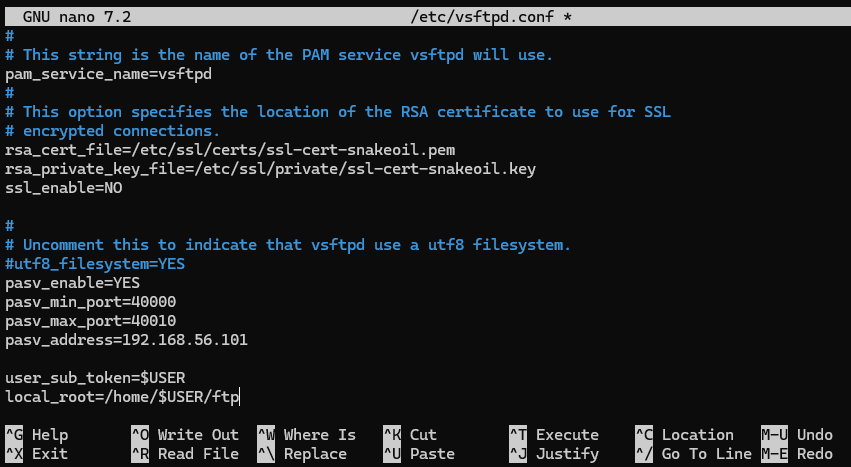

### Líneas añadidas o modificadas

    listen=YES
    listen_ipv6=NO
    anonymous_enable=NO
    local_enable=YES
    write_enable=YES
    local_umask=022

    chroot_local_user=YES
    allow_writeable_chroot=YES

    pasv_enable=YES
    pasv_min_port=40000
    pasv_max_port=40010
    pasv_address=192.168.56.101

    user_sub_token=$USER
    local_root=/home/$USER/ftp

### Explicación de los parámetros

*   **listen=YES**  
    Activa el modo standalone para que vsftpd escuche conexiones IPv4.

*   **listen\_ipv6=NO**  
    Desactiva IPv6 para evitar conflictos; solo se usa IPv4 en este laboratorio.

*   **anonymous\_enable=NO**  
    Bloquea acceso de usuarios anónimos (mejora de seguridad).

*   **local\_enable=YES**  
    Permite que usuarios locales del sistema se autentiquen (como `ftpuser`).

*   **write\_enable=YES**  
    Habilita operaciones de escritura (upload, rename, delete).

*   **local\_umask=022**  
    Define permisos por defecto para archivos creados por usuarios FTP.

*   **chroot\_local\_user=YES**  
    Encierra al usuario en su directorio home (jaula FTP).

*   **allow\_writeable\_chroot=YES**  
    Permite escritura dentro del directorio chroot sin causar errores de seguridad.

*   **pasv\_enable=YES**  
    Habilita el modo FTP pasivo (necesario para clientes como FileZilla).

*   **pasv\_min\_port / pasv\_max\_port**  
    Rango de puertos pasivos permitidos para conexiones.  
    En este caso: **40000–40010**.

*   **pasv\_address=192.168.56.101**  
    IP del servidor en la red Host-Only.  
    Es necesaria para que el cliente pueda conectarse correctamente en modo pasivo.

*   **user\_sub\_token=$USER**  
    Permite usar variables como `$USER` dentro de rutas dinámicas.

*   **local\_root=/home/$USER/ftp**  
    Establece el directorio donde el usuario quedará confinado al iniciar sesión.

***

## Notas importantes

*   Es obligatorio reiniciar el servicio después de modificar `vsftpd.conf`.
*   La IP usada en `pasv_address` debe ser la del adaptador Host-Only del servidor.
*   El rango de puertos pasivos debe estar permitido en firewall si existiera.
*   Estas opciones permiten que FileZilla funcione correctamente sin errores de conexión.

***

# FASE 7: Configuración del firewall y reinicio del servicio FTP

## Introducción

En esta fase permitimos en el firewall de Ubuntu los puertos necesarios para que el servidor FTP funcione correctamente, tanto en modo activo como pasivo. Después, reiniciamos el servicio para aplicar los cambios realizados en la configuración anterior y comprobamos que funciona sin errores.

## Objetivo

*   Abrir el puerto 21 (FTP estándar).
*   Permitir el rango de puertos pasivos configurado previamente (40000–40010).
*   Reiniciar vsftpd para aplicar los cambios.
*   Verificar que el servicio está activo y funcionando.

***

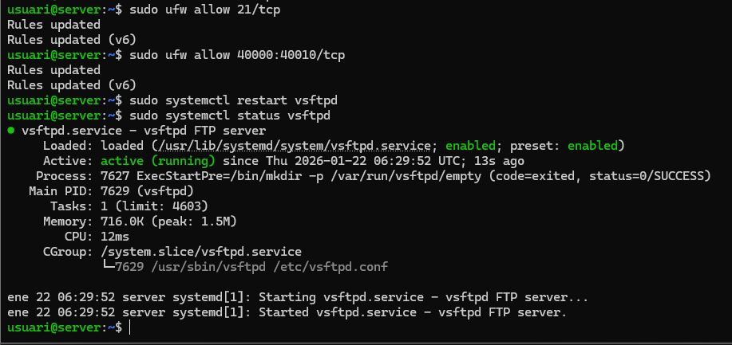

## PASO 1 — Permitir el puerto 21 (FTP)

### Comando ejecutado

    sudo ufw allow 21/tcp

### Explicación del comando

*   **sudo**: permisos administrativos.
*   **ufw**: firewall sencillo de Ubuntu.
*   **allow**: permite tráfico entrante.
*   **21/tcp**: puerto estándar del protocolo FTP.

***

## PASO 2 — Permitir el rango de puertos pasivos

### Comando ejecutado

    sudo ufw allow 40000:40010/tcp

### Explicación del comando

*   **40000:40010**: rango de puertos previamente configurados en `vsftpd.conf` para modo pasivo.
*   **tcp**: FTP utiliza este protocolo tanto para control como para datos.

***

## PASO 3 — Reiniciar el servicio vsftpd

### Comando ejecutado

    sudo systemctl restart vsftpd

### Explicación del comando

*   **systemctl**: herramienta para gestionar servicios.
*   **restart**: detiene y vuelve a iniciar el servicio aplicando cambios de configuración.
*   **vsftpd**: servicio del servidor FTP.

***

## PASO 4 — Comprobar el estado del servicio

### Comando ejecutado

    sudo systemctl status vsftpd

### Explicación del comando

*   Verifica que el servicio está **active (running)**.
*   Confirma que no existen errores en la carga del archivo `vsftpd.conf`.
*   Asegura que el reinicio se realizó correctamente.

***

## Notas importantes

*   Si el firewall no está habilitado, UFW mostrará un aviso; en ese caso debes activarlo con `sudo ufw enable`.
*   El rango de puertos pasivos debe coincidir exactamente con lo configurado en `/etc/vsftpd.conf`.
*   Si el servicio falla al reiniciar, normalmente es por un error de sintaxis en `vsftpd.conf`.

***

# FASE 8: Conexión al servidor FTP desde el cliente Windows (modo consola)

## Introducción

En esta fase probamos la conexión desde el cliente Windows 11 al servidor FTP Ubuntu usando el cliente FTP integrado en Windows (desde PowerShell). Verificamos que el usuario `ftpuser` puede autenticarse correctamente.

## Objetivo

*   Situarse en un directorio local concreto en Windows.
*   Conectarse por FTP a la IP del servidor.
*   Iniciar sesión correctamente con el usuario `ftpuser`.

***
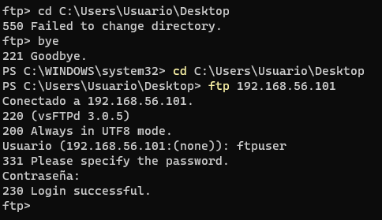

## PASO 1 — Cambiar al directorio de trabajo local en Windows

### Comando ejecutado

```
cd C:\Users\Usuario\Desktop
```

### Explicación del comando

*   **cd**: cambia el directorio actual.
*   **C:\Users\Usuario\Desktop**: ruta local donde quieres trabajar (por ejemplo, para subir o descargar archivos).  
    Este cambio de directorio afecta solo al entorno local de Windows, no al servidor FTP.

***

## PASO 2 — Iniciar la sesión FTP contra el servidor

### Comando ejecutado

```
ftp 192.168.56.101
```

### Explicación del comando

*   **ftp**: cliente FTP por consola incluido en Windows.
*   **192.168.56.101**: dirección IP del servidor FTP (Ubuntu) en la red Host-Only.  
    Al ejecutarlo, se abre una sesión interactiva FTP y el servidor responde con su banner (`vsFTPD 3.0.5` en tu caso).

***

## PASO 3 — Autenticarse como usuario ftpuser

Dentro del prompt `ftp>`:

1.  El cliente pide el **usuario**:
    `
    Usuario (192.168.56.101:(none)): ftpuser
    `

2.  Luego solicita la **contraseña**:
    `
    Contraseña:
    `

Tras introducir la contraseña correcta, aparece:

`
230 Login successful.
ftp>
`

### Explicación

*   **ftpuser**: usuario local del sistema Ubuntu creado previamente.
*   **Contraseña**: la definida al crear el usuario con `adduser`.
*   **230 Login successful**: el servidor ha aceptado las credenciales y la sesión se ha establecido correctamente.

***

## Notas importantes

*   Si aparece `530 Login incorrect`, revisar usuario/contraseña o que `local_enable=YES` esté configurado en `vsftpd.conf`.
*   Esta prueba confirma que:
    *   El servicio vsftpd está activo.
    *   El firewall permite las conexiones.
    *   La red Host-Only funciona correctamente.
*   Desde el prompt `ftp>` ya puedes listar archivos (`ls`), cambiar directorio (`cd`) o subir/bajar ficheros (`put`, `get`).

***

# FASE 9: Prueba de subida de archivos al servidor FTP (cliente Windows)

## Introducción

En esta fase verificamos que el usuario `ftpuser` puede **subir archivos** al servidor FTP desde la consola del cliente Windows, usando el comando `put`. Esto confirma que los permisos y la configuración del modo pasivo/activo están funcionando correctamente.

## Objetivo

*   Subir un archivo desde el cliente Windows al servidor Ubuntu.
*   Confirmar que el servidor acepta la operación de carga.
*   Validar la correcta comunicación del canal de datos FTP.

***

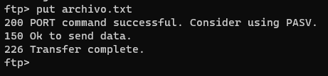

## PASO 1 — Subir un archivo al servidor FTP

### Comando ejecutado dentro de la sesión `ftp>`

    put archivo.txt

### Explicación del comando

*   **put**: comando FTP para subir un archivo desde el cliente al servidor.
*   **archivo.txt**: nombre del archivo ubicado en el directorio local actual de Windows (en este caso, `Desktop`).

### Explicación de la salida mostrada

*   **200 PORT command successful. Consider using PASV.**  
    El servidor acepta el modo activo, pero recomienda usar modo pasivo (ya lo configuraste antes).
*   **150 Ok to send data.**  
    El servidor abre el canal de datos y está listo para recibir el archivo.
*   **226 Transfer complete.**  
    La transferencia se realizó correctamente y el archivo ya está disponible en `/home/ftpuser/ftp`.

***

## Notas importantes

*   Para que la subida funcione, el directorio `/home/ftpuser/ftp` debe pertenecer a `ftpuser`, como configuraste previamente.
*   Si el servidor rechaza la operación con `553` o `550`, normalmente indica permisos incorrectos.
*   Aunque el mensaje recomienda PASV, la transferencia en modo activo funcionó correctamente (FileZilla sí usará PASV).
*   Esta prueba confirma que el canal de datos está operativo y que el firewall permite la conexión.

***

# FASE 10: Conexión al servidor FTP usando FileZilla (cliente gráfico)

## Introducción

En esta fase realizamos la conexión al servidor FTP desde FileZilla, un cliente gráfico ampliamente utilizado. Esta prueba permite verificar el funcionamiento del modo pasivo, la autenticación del usuario y la correcta visualización del directorio remoto.

## Objetivo

*   Configurar FileZilla con la IP del servidor FTP.
*   Introducir las credenciales del usuario `ftpuser`.
*   Establecer la conexión y acceder al directorio `/ftp`.

***

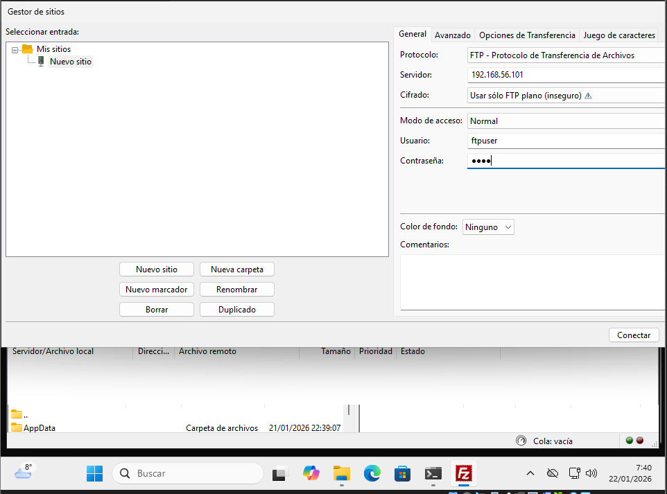

## PASO 1 — Abrir el Gestor de Sitios en FileZilla

### Acción realizada

En FileZilla → **Archivo > Gestor de sitios** → *Nuevo sitio*.

### Explicación

El Gestor de sitios permite guardar configuraciones para conexiones recurrentes y definir parámetros de acceso como protocolo, cifrado y usuario.

***

## PASO 2 — Configurar los parámetros de conexión

### Configuración introducida (según la imagen)

*   **Protocolo:** FTP – Protocolo de Transferencia de Archivos
*   **Servidor:** `192.168.56.101`
*   **Cifrado:** Usar sólo FTP plano (inseguro)
*   **Modo de acceso:** Normal
*   **Usuario:** `ftpuser`
*   **Contraseña:** (la creada previamente)

### Explicación de cada punto

*   **FTP plano:** se usa porque estamos trabajando con un servidor FTP sin cifrado (vsftpd en modo estándar).
*   **IP 192.168.56.101:** dirección del servidor en la red Host-Only.
*   **Modo Normal:** permite introducir usuario y contraseña.
*   **ftpuser:** usuario local configurado previamente.

***

## PASO 3 — Conectar al servidor

### Acción realizada

Pulsar **Conectar**.

### Qué está ocurriendo internamente

*   FileZilla envía las credenciales al servidor.
*   vsftpd autentica al usuario.
*   Se establece el modo pasivo utilizando los puertos 40000–40010 configurados.
*   Se muestra el contenido del directorio remoto `/home/ftpuser/ftp`.

***

## Notas importantes

*   Si FileZilla muestra errores relacionados con modo pasivo, revisar `pasv_address` o el firewall.
*   FileZilla marcará como “insegura” la conexión por ser FTP sin cifrar (comportamiento normal).
*   Si la conexión funciona aquí, toda la configuración del servidor FTP es correcta.
*   Para evitar advertencias, la alternativa sería usar SFTP (más adelante en la parte de la práctica SFTP).

***

# FASE 11: Captura y análisis del tráfico FTP con Wireshark

## Introducción

En esta fase utilizamos **Wireshark** en el cliente Windows para observar cómo viajan los datos durante una conexión FTP realizada con FileZilla. Esto permite comprobar que el protocolo FTP transmite información en texto plano y visualizar el uso del modo pasivo configurado.

## Objetivo

*   Iniciar la captura en la interfaz Host‑Only.
*   Establecer una conexión FTP desde FileZilla.
*   Observar paquetes de control y datos en Wireshark.
*   Verificar que las credenciales y comandos viajan sin cifrar.

***

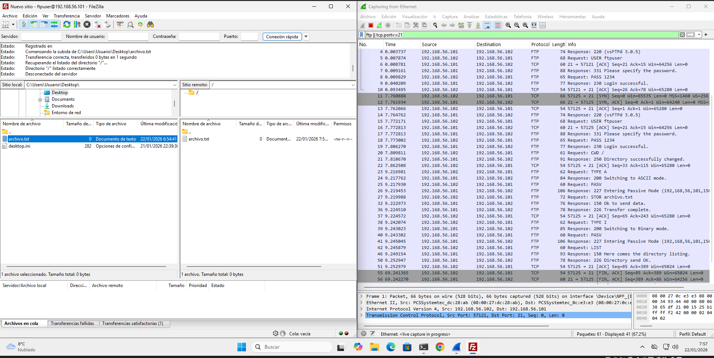

## PASO 1 — Iniciar captura en Wireshark

### Acción realizada

En Wireshark → seleccionar la interfaz correspondiente a la red Host‑Only → **Start Capture**.

### Explicación

*   La interfaz Host‑Only es la que conecta Windows y Ubuntu dentro del entorno de VirtualBox.
*   Al iniciar la captura antes de abrir FileZilla, podremos ver todo el intercambio FTP, desde el login hasta la transferencia de archivos.

***

## PASO 2 — Conectar con FileZilla mientras Wireshark captura

### Acción realizada

Abriste FileZilla, te conectaste al servidor `192.168.56.101` y visualizaste el directorio remoto mientras Wireshark seguía capturando.

### Explicación

Durante esta conexión se generan varios tipos de paquetes:

*   **Paquetes de control FTP (puerto 21)** → comandos como USER, PASS, LIST.
*   **Paquetes de datos en puertos pasivos 40000–40010** → transferencias de archivos o listados.
*   **Respuestas del servidor** → código 150, 226, 230, etc.

***

## PASO 3 — Identificación del tráfico en Wireshark

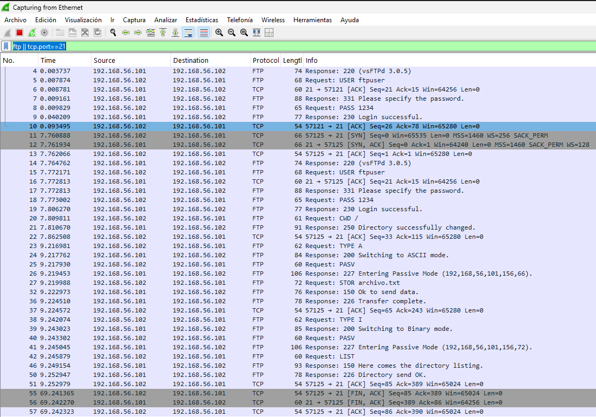

### Lo que se observa en la imagen

*   Filas marcadas como **FTP** (control).
*   Filas marcadas como **TCP** en puertos altos (datos).
*   Información legible: comandos, rutas, nombres de archivo, etc.

### Explicación técnica

*   FTP es un protocolo **sin cifrar**, por lo que todo se puede leer directamente.
*   Se pueden visualizar:
    *   **USER ftpuser**
    *   **PASS (contraseña en texto plano)**
    *   **LIST** y resultados del listado.
    *   **STOR / RETR** para subida o descarga.
*   El uso del modo pasivo se confirma por el establecimiento de conexiones a puertos 40000–40010.

***

## Notas importantes

*   Esta demostración es fundamental para entender por qué FTP es inseguro en redes reales.
*   FTP transmite **usuario, contraseña y archivos sin cifrar**, lo que permite capturas claras como la mostrada.
*   Más adelante, en la parte SFTP, se mostrará cómo la misma operación no revela información sensible.
*   Es recomendable detener la captura después de finalizar la conexión para guardar el archivo `.pcap` si se requiere para entrega.

***

# FASE 12: Instalación y comprobación del servicio SSH

## Introducción

En esta fase instalamos y verificamos el funcionamiento del servicio **SSH** en Ubuntu Server. SSH será necesario más adelante para implementar **SFTP**, la alternativa segura al FTP tradicional.

## Objetivo

*   Instalar el paquete `openssh-server`.
*   Verificar que el servicio está activo y en ejecución.
*   Confirmar que el puerto SSH (22) está escuchando.

***

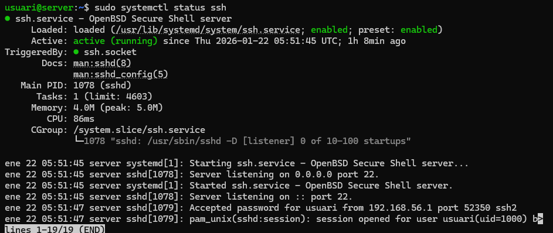

## PASO 1 — Instalar el servidor SSH

### Comando ejecutado

    sudo apt install openssh-server -y

### Explicación del comando

*   **sudo**: permisos de administrador necesarios para instalar paquetes.
*   **apt**: gestor de paquetes de Ubuntu.
*   **install**: instala el paquete especificado.
*   **openssh-server**: servicio que permite conexiones SSH y habilita SFTP.
*   **-y**: acepta automáticamente la instalación.

***

## PASO 2 — Comprobar el estado del servicio SSH

### Comando ejecutado

    sudo systemctl status ssh

### Explicación del comando

*   **systemctl**: herramienta para gestionar servicios en sistemas con systemd.
*   **status**: muestra información del estado actual.
*   **ssh**: nombre del servicio que gestiona el servidor OpenSSH.

### Qué debe mostrar

*   **active (running)** → SSH está funcionando.
*   **enabled** → se iniciará automáticamente al arrancar el sistema.

***

## Notas importantes

*   SSH usa el puerto **22/tcp** por defecto; si tienes UFW activado, deberás permitirlo más adelante.
*   La activación del servicio SSH es imprescindible para poder usar SFTP.
*   No se requiere configuración adicional para permitir conexiones SFTP básicas, ya que viene habilitado por defecto.

***
# FASE 13: Creación del usuario para SFTP

## Introducción

En esta fase creamos un nuevo usuario llamado **sftpuser**, que será utilizado exclusivamente para acceder mediante **SFTP** (SSH File Transfer Protocol). Este usuario se gestionará igual que el creado para FTP, pero se empleará dentro del entorno seguro proporcionado por SSH.

## Objetivo

*   Crear el usuario `sftpuser`.
*   Definir su contraseña.
*   Registrar su información básica.

***

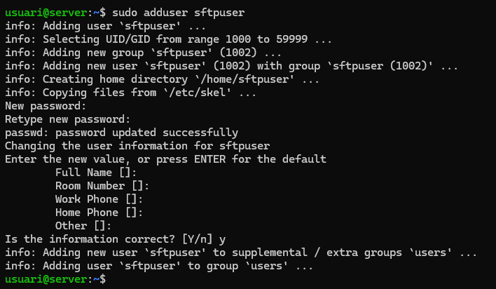

## PASO 1 — Crear el usuario del sistema para SFTP

### Comando ejecutado

    sudo adduser sftpuser

### Explicación del comando

*   **sudo**: ejecuta el comando con permisos administrativos.
*   **adduser**: asistente interactivo para crear usuarios en Linux.
*   **sftpuser**: nombre del usuario destinado exclusivamente para conexiones SFTP.

Durante la ejecución se solicita:

*   Contraseña para `sftpuser`.
*   Información opcional (nombre completo, teléfono, etc.).
*   Confirmación final de creación.

***

## Notas importantes

*   Este usuario funcionará bajo el servicio SSH, no bajo vsftpd.
*   Por defecto, SSH ya permite acceder mediante SFTP a cualquier usuario del sistema sin configuración adicional.
*   En fases posteriores, se configurará una jaula chroot especial para restringir el entorno de `sftpuser`.

***

# FASE 14: Preparación del entorno y permisos para el usuario SFTP

## Introducción

En esta fase creamos la estructura de directorios necesaria para el usuario `sftpuser` y ajustamos permisos específicos para cumplir con los requisitos de una jaula SFTP segura bajo SSH.

## Objetivo

*   Crear el directorio de trabajo `/home/sftpuser/upload`.
*   Proteger el directorio home del usuario (`/home/sftpuser`).
*   Asignar permisos correctos para permitir subida de archivos solo dentro de `upload`.

***

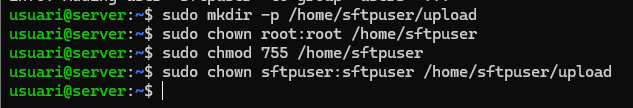

## PASO 1 — Crear el directorio de subida para SFTP

### Comando ejecutado

    sudo mkdir -p /home/sftpuser/upload

### Explicación del comando

*   **sudo**: necesario para modificar directorios de otros usuarios.
*   **mkdir**: crea directorios.
*   **-p**: crea también directorios intermedios si no existen.
*   **/home/sftpuser/upload**: carpeta donde el usuario podrá subir archivos vía SFTP.

***

## PASO 2 — Proteger el directorio principal del usuario

### Comando ejecutado

    sudo chown root:root /home/sftpuser

### Explicación del comando

*   **chown**: cambia propietario/grupo.
*   **root:root**: propietario y grupo pasan a ser root.
*   **/home/sftpuser**: directorio principal del usuario.  
    SSH exige que el `home` tenga propietario root para poder aplicar chroot de forma segura.

***

## PASO 3 — Ajustar permisos del directorio principal

### Comando ejecutado

    sudo chmod 755 /home/sftpuser

### Explicación del comando

*   **chmod**: modifica permisos.
*   **755**:
    *   root: lectura, escritura, ejecución
    *   otros: lectura y ejecución  
        Permite que el usuario acceda a su home pero no pueda modificarlo.

***

## PASO 4 — Asignar permisos del directorio de subida

### Comando ejecutado

    sudo chown sftpuser:sftpuser /home/sftpuser/upload

### Explicación del comando

*   **sftpuser:sftpuser**: el usuario puede leer/escribir en este directorio.
*   **/home/sftpuser/upload**: único espacio donde tendrá permisos de escritura.

***

## Notas importantes

*   El modelo de permisos es **obligatorio** para una jaula SFTP segura:
    *   `/home/sftpuser` → propiedad root
    *   `/home/sftpuser/upload` → propiedad sftpuser
*   Si el directorio principal pertenece al usuario y no a root, el servicio SFTP fallará al iniciar sesión.
*   Este esquema impide que el usuario escape de la jaula o modifique el directorio base.

***

# FASE 15: Configuración de SFTP seguro en `sshd_config`

## Introducción

En esta fase configuramos el servicio SSH para que el usuario `sftpuser` **solo pueda usar SFTP**, quede encerrado en una jaula (`chroot`) y no tenga acceso a la shell ni a reenvío de puertos. Esto garantiza un entorno seguro y aislado.

## Objetivo

*   Editar el archivo `/etc/ssh/sshd_config`.
*   Definir el subsistema SFTP interno.
*   Crear una regla específica para el usuario `sftpuser`.
*   Restringirlo a su directorio y desactivar acceso SSH interactivo.

***

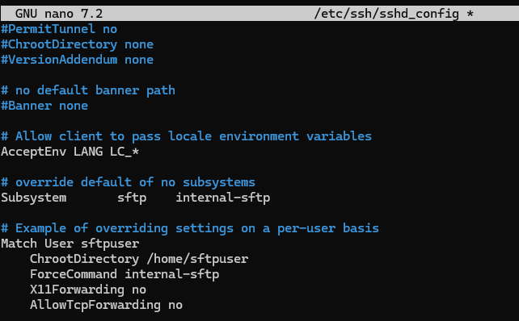

## PASO 1 — Editar el archivo de configuración SSH

### Comando ejecutado

    sudo nano /etc/ssh/sshd_config

### Explicación

*   **sudo**: necesario para modificar archivos del sistema.
*   **nano**: editor de texto.
*   **/etc/ssh/sshd\_config**: archivo principal de configuración del servicio SSH.

***

## PASO 2 — Configurar el subsistema SFTP interno

### Línea utilizada

    Subsystem sftp internal-sftp

### Explicación

*   **Subsystem sftp**: indica qué programa debe manejar las conexiones SFTP.
*   **internal-sftp**: evita usar `/usr/lib/openssh/sftp-server` y usa el motor interno, más seguro para jaulas chroot.

***

## PASO 3 — Crear una regla específica para el usuario `sftpuser`

### Bloque añadido

    Match User sftpuser
        ChrootDirectory /home/sftpuser
        ForceCommand internal-sftp
        X11Forwarding no
        AllowTcpForwarding no

### Explicación detallada

*   **Match User sftpuser**  
    Activa esta configuración solo para el usuario `sftpuser`.

*   **ChrootDirectory /home/sftpuser**  
    Encierra al usuario en este directorio, impidiendo que navegue por el resto del sistema.

*   **ForceCommand internal-sftp**  
    Obliga al usuario a usar únicamente SFTP; no podrá abrir una shell SSH.

*   **X11Forwarding no**  
    Evita que el usuario intente abrir aplicaciones gráficas remotas (innecesario y más seguro deshabilitarlo).

*   **AllowTcpForwarding no**  
    Evita túneles SSH y reenvío de puertos.
    
Y un reset y status

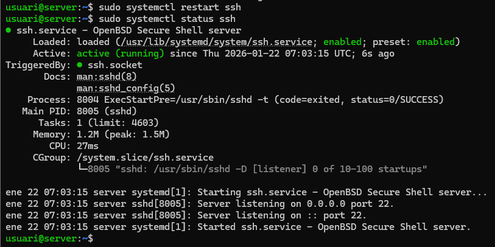

***

## Notas importantes

*   El directorio indicado en `ChrootDirectory` **debe ser propiedad de root**, tal como configuraste previamente.
*   El usuario solo podrá escribir en `/home/sftpuser/upload`, no en el directorio raíz de su jaula.
*   Tras los cambios, es obligatorio reiniciar el servicio SSH usando:
        sudo systemctl restart ssh
*   Si el usuario no puede iniciar sesión, revisa permisos del directorio:
    *   `/home/sftpuser` → root:root y 755
    *   `/home/sftpuser/upload` → sftpuser:sftpuser

***

# FASE 16: Conexión SFTP desde Windows y prueba de subida de archivos

## Introducción

En esta fase probamos el acceso **SFTP** desde el cliente Windows hacia el servidor Ubuntu, utilizando el usuario `sftpuser` y verificando que solo puede trabajar dentro de su jaula (`/home/sftpuser`) y subir archivos al directorio `upload`.

## Objetivo

*   Conectarse por SFTP desde Windows al servidor Ubuntu.
*   Acceder al directorio `upload`.
*   Subir un archivo y comprobar que aparece en el listado remoto.

***

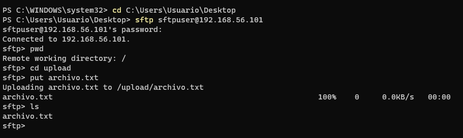

### 1. Cambiar al directorio local de trabajo en Windows

#### Comando ejecutado

```
cd C:\Users\Usuario\Desktop
```

#### Explicación

*   **cd**: cambia el directorio actual.
*   **C:\Users\Usuario\Desktop**: ruta local donde se encuentra el archivo `archivo.txt` que se va a subir por SFTP.

***

### 2. Conectarse por SFTP al servidor

#### Comando ejecutado

```
sftp sftpuser@192.168.56.101
```

#### Explicación

*   **sftp**: cliente SFTP por consola (basado en SSH).
*   **sftpuser\@192.168.56.101**:
    *   `sftpuser`: usuario del servidor Ubuntu.
    *   `192.168.56.101`: IP del servidor en la red Host-Only.

Al ejecutarlo, pide la contraseña de `sftpuser` y, tras introducirla, se muestra:

`
Connected to 192.168.56.101.
`

indicando que la conexión se ha establecido correctamente por SSH.

***

### 3. Verificar el directorio remoto inicial

#### Comando ejecutado dentro de `sftp>`

```
pwd
```

#### Explicación

*   **pwd** (print working directory): muestra el directorio remoto actual.
*   Respuesta:
    `
    Remote working directory: /
    `
    En el contexto de la jaula chroot, `/` corresponde a `/home/sftpuser` en el servidor.

***

### 4. Acceder al directorio de subida

#### Comando ejecutado

```
cd upload
```

#### Explicación

*   **cd upload**: cambia al subdirectorio `upload` dentro de la jaula SFTP.
*   Este es el directorio donde `sftpuser` tiene permisos de escritura.

***

### 5. Subir el archivo al servidor

#### Comando ejecutado

```
put archivo.txt
```

#### Explicación

*   **put**: comando SFTP para subir un archivo desde el cliente al servidor.
*   **archivo.txt**: fichero que se encuentra en el directorio local actual (`Desktop`).
*   La salida indica algo similar a:
    `
    Uploading archivo.txt to /upload/archivo.txt
    archivo.txt                                  100%
    `
    Lo que confirma que la subida se ha realizado con éxito al directorio `/upload`.

***

### 6. Listar el contenido del directorio remoto

#### Comando ejecutado

```
ls
```

#### Explicación

*   **ls**: lista archivos del directorio remoto actual.
*   La aparición de `archivo.txt` en la lista confirma que el archivo ha sido subido correctamente a `/home/sftpuser/upload`.

***

## Notas importantes

*   La ruta `/` que muestra `pwd` es en realidad la raíz de la jaula chroot (`/home/sftpuser`), no la raíz real del sistema.
*   `sftpuser` no puede salir de esa jaula ni ejecutar comandos de shell gracias a `ForceCommand internal-sftp`.
*   A diferencia de FTP, todo el tráfico (credenciales y datos) va **cifrado** a través de SSH, por lo que no es legible en herramientas como Wireshark.
*   Esta prueba confirma que la configuración de `sshd_config`, los permisos de `/home/sftpuser` y `/home/sftpuser/upload` y el servicio SSH están correctamente aplicados.

***

# FASE 18: Comparativa final — Resultados de FTP vs SFTP (con evidencias y capturas)

## Introducción

En esta fase mostramos los **resultados finales** de ambas configuraciones: FTP y SFTP. Se verifican los servicios activos, las conexiones desde Windows y las capturas de tráfico en Wireshark, demostrando claramente la diferencia entre datos **en texto claro (FTP)** y **cifrados (SFTP)**.

## Objetivo

*   Validar el estado de los servicios `vsftpd` y `ssh`.
*   Comprobar conexión FTP y SFTP desde el cliente Windows.
*   Capturar y analizar el tráfico con Wireshark, resaltando la diferencia entre ambos protocolos.
*   Mostrar la evidencia visual del resultado final (tal como en tus capturas).

***


### 1. Estado del servicio FTP (vsftpd)

#### Comando ejecutado

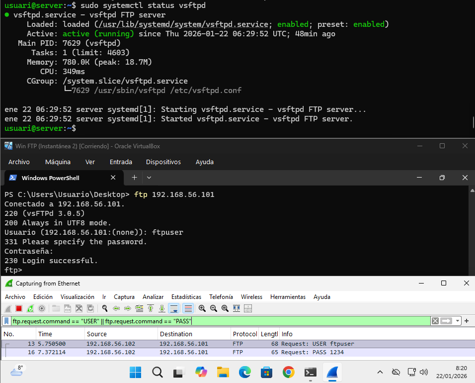

    sudo systemctl status vsftpd

#### Explicación

*   **systemctl status**: muestra el estado del servicio.
*   **vsftpd**: servidor FTP.
*   Debe aparecer **active (running)** y **enabled**, tal como se ve en tu captura.

***

### 2. Conexión FTP desde Windows

#### Comando ejecutado

```
ftp 192.168.56.101
```

#### Explicación

*   **ftp**: cliente FTP básico de Windows.
*   **192.168.56.101**: IP del servidor en red Host‑Only.
*   Usuario: `ftpuser` → autenticación correcta.

#### Evidencia en Wireshark

*   Aparecen paquetes **FTP**.
*   Se ven los comandos:
    *   `USER ftpuser`
    *   `PASS 1234`
*   Todo en texto claro, completamente legible.  
    Esto confirma que **FTP no cifra nada**.

***

### 3. Estado del servicio SSH (para SFTP)

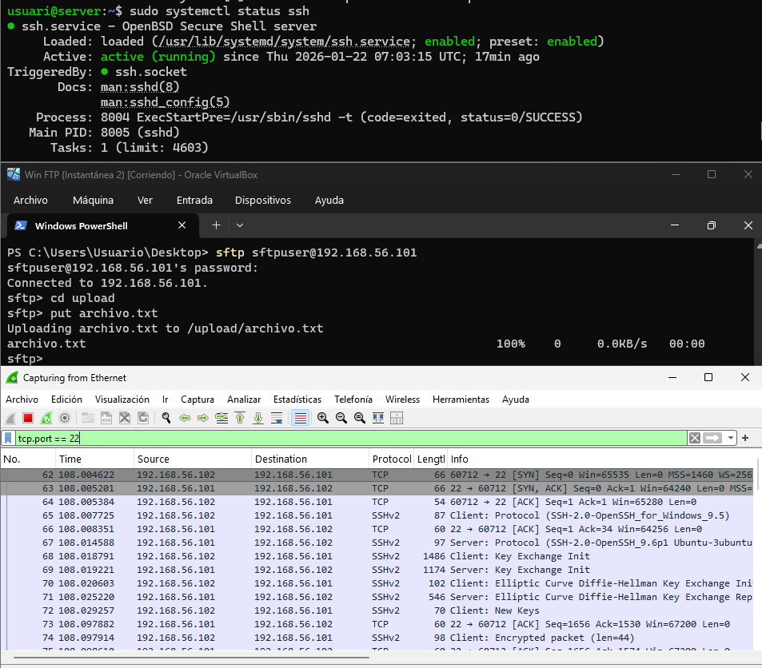

#### Comando ejecutado

    sudo systemctl status ssh

#### Explicación

*   **ssh**: servicio OpenSSH.
*   Debe verse **active (running)** y **enabled**.
*   SSH proporciona el canal seguro para SFTP.

***

### 4. Conexión SFTP desde Windows

#### Comando ejecutado

```powershell
sftp sftpuser@192.168.56.101
```

#### Explicación

*   **sftp** usa SSH, no FTP.
*   Usuario: `sftpuser`.
*   Acceso al directorio `upload` y subida correcta de `archivo.txt`.

***

### 5. Evidencia SFTP en Wireshark

#### Lo que muestra Wireshark

*   Paquetes del protocolo **SSH** o **SSHv2**.
*   Mensajes del tipo:
    *   `Encrypted packet (len=...)`
    *   `Key Exchange Init`
    *   `Diffie-Hellman Key Exchange`
*   No aparecen comandos ni contraseñas visibles.

#### Explicación

*   Todo el tráfico está **cifrado** dentro del túnel SSH.
*   No es posible ver usuario, contraseña, comandos o nombres de archivo.

***

## Notas importantes

*   FTP → **Inseguro**, transmite credenciales y datos sin cifrar.
*   SFTP → **Seguro**, todo el tráfico cifrado mediante SSH.
*   Las capturas finales muestran exactamente la diferencia requerida por la práctica.
*   Esta fase sirve como cierre comparativo y evidencia para el informe final o examen práctico.
