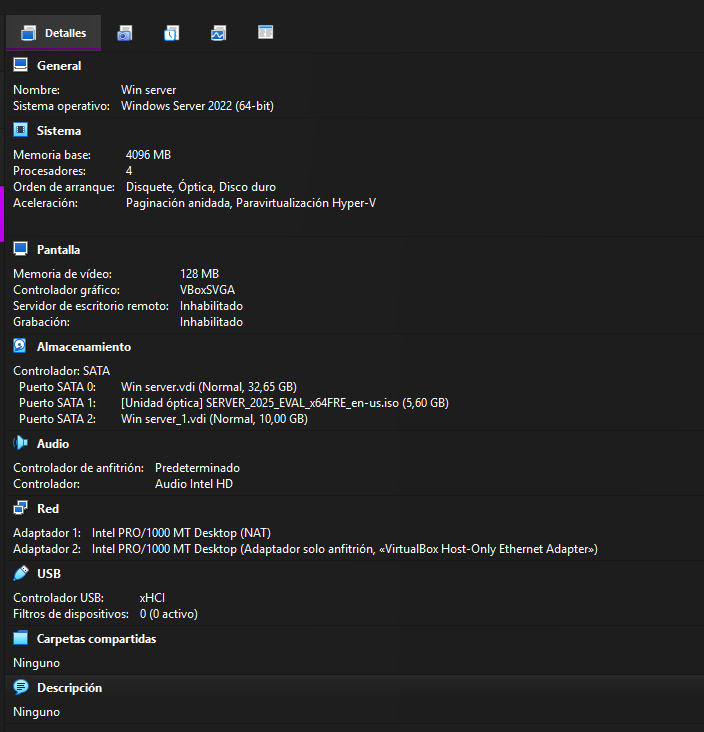

# **T04: Instalación de Windows Server 2025 (VirtualBox)***

# **1. Breve descripción**

En esta práctica se instala **Windows Server 2025** en una máquina virtual de VirtualBox para preparar el entorno de trabajo que se utilizará en las tareas posteriores (T05, T06...).

***

# **2. Introducción al caso**

Tras un primer asesoramiento, **TransLògic S.A.** solicita el despliegue de una infraestructura basada en Windows Server 2025.

Antes de realizar la implantación definitiva, se requiere una **instalación de prueba** con las buenas prácticas recomendadas:

*   Creación y configuración adecuada de la máquina virtual
*   Instalación del sistema operativo
*   Configuraciones locales y de teclado
*   Cambio de nombre del servidor
*   Actualizaciones y mantenimiento inicial
*   Comparación técnica con los requisitos oficiales de Microsoft

Esta guía documenta el procedimiento completo.

***

# **3. Creación de la Máquina Virtual**

### **3.1. Parámetros de la VM**

*   **RAM:** 4 GB
*   **CPU:** 4 procesadores
*   **Disco principal:** 32 GB (SO)
*   **Disco secundario:** 10 GB (datos)
*   **Red:**
    *   Adaptador 1 → NAT
    *   Adaptador 2 → Host-only

***

### **3.2. Procedimiento en VirtualBox**

1.  Abrir **VirtualBox** → **New**
2.  Asignar:
    *   Nombre: `WS2025-Instalación`
    *   Tipo: *Microsoft Windows*
    *   Versión: *Windows 2022 / Other Windows*
3.  Configurar:
    *   RAM: 8192 MB
    *   CPU: 2 vCPU
4.  Crear disco:
    *   **Create a virtual hard disk now (32 GB)**
5.  Abrir **Settings**:
    *   **Storage** → Add Hard Disk → 10 GB
    *   **Network → Adapter 1: NAT**
    *   **Network → Adapter 2: Host-only**

***

# **4. Instalación de Windows Server 2025 (GUI)**

> **Cumple rúbrica: Instal·lació: disc + instal·lació de SO + localización/teclado (3 puntos)**

### **4.1. Arranque e inicio del instalador**

1.  Cargar el ISO:  
    `Settings → Storage → Controller IDE → Choose disk file`
2.  Iniciar la VM.
3.  En la primera pantalla:
    *   **Language:** English (United States)
    *   **Time and currency format:** Spanish (Spain)
    *   **Keyboard:** Spanish
4.  Pulsar **Install now**.

***

### **4.2. Selección de edición**

Elegir:

    Windows Server 2025 Standard (Desktop Experience)

*   Aceptar licencia
*   Seleccionar **Custom installation**
*   Elegir el disco de **32 GB**

***

### **4.3. Configuraciones iniciales**

1.  Esperar el reinicio automático.
2.  Crear contraseña para **Administrator**.
3.  Iniciar sesión.

> **Evidencias recomendadas:**
>
> *   Pantalla de selección de edición
> *   Selección del disco
> *   Primera pantalla de login

***

# **5. Configuraciones locales y de teclado**

> **Cumple rúbrica: Instal·lació: configuracions locals i teclat (1 punt)**

Tras acceder:

1.  Abrir **Settings → Time & Language**.
2.  Revisar:
    *   Región: *España*
    *   Formato: *Spanish (Spain)*
    *   Teclado: *Spanish*
3.  Abrir **Date & Time**:
    *   Zona horaria: *(UTC+01:00) Madrid*
    *   Opcional: **Sync now**

> **Evidencia recomendada:** captura de teclado/zona horaria.

***

# **6. Cambio de nombre del servidor**

> **Cumple rúbrica: Canvi de nom del servidor (1 punt)**

1.  Abrir **Server Manager**.
2.  Ir a **Local Server**.
3.  En *Computer Name*, elegir **Change**.
4.  Asignar:

<!---->

    DC10

5.  Aceptar y reiniciar el servidor.

***

# **7. Actualización del sistema y pausa de actualizaciones**

> **Cumple rúbrica: Màquina actualitzada i actualitzacions pausades (1 punt)**

### **7.1. Actualizar**

1.  Abrir **Settings → Windows Update**.
2.  Pulsar **Check for updates**.
3.  Instalar todo.
4.  Reiniciar si es necesario.

### **7.2. Pausar actualizaciones**

1.  Volver a **Windows Update**.
2.  Seleccionar:  
    **Pause updates**
3.  Elegir la pausa más larga disponible.

> **Evidencia recomendada:** captura mostrando que las actualizaciones están pausadas.

***

# **8. Comparación con los requisitos oficiales de Microsoft**

> **Cumple rúbrica: Comparació amb requisits de Microsoft (1 punt)**

Según Microsoft Learn, los requisitos mínimos para Windows Server (GUI) son aproximadamente:

| Componente | Requisito mínimo   | Configuración de la VM | Comentario        |
| ---------- | ------------------ | ---------------------- | ----------------- |
| CPU        | 1.4 GHz 64‑bit     | 2 vCPU                 | Correcto (supera) |
| RAM        | 4 GB GUI           | 8 GB                   | Muy superior      |
| Disco      | 32 GB              | 32 + 10 GB             | Correcto          |
| Red        | Adaptador Ethernet | NAT + Host-Only        | Correcto          |

### **Conclusión técnica**

Sí, la configuración de la máquina virtual es **totalmente coherente** y supera los requisitos mínimos del fabricante, por lo que es adecuada para prácticas y entornos de prueba.

