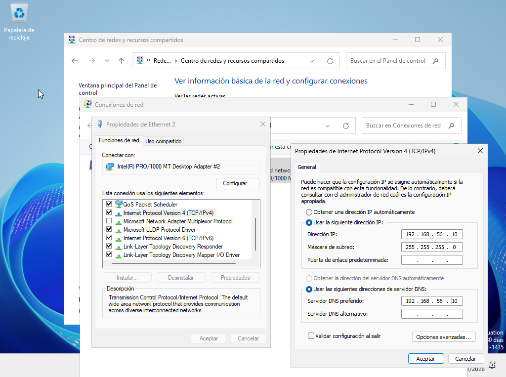
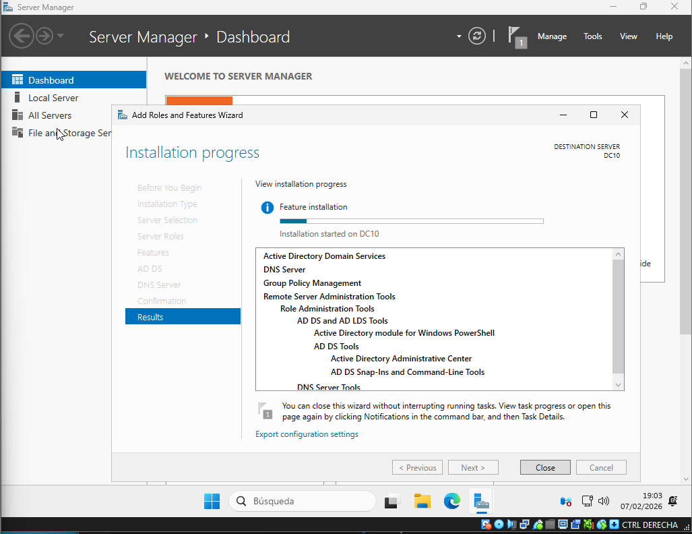
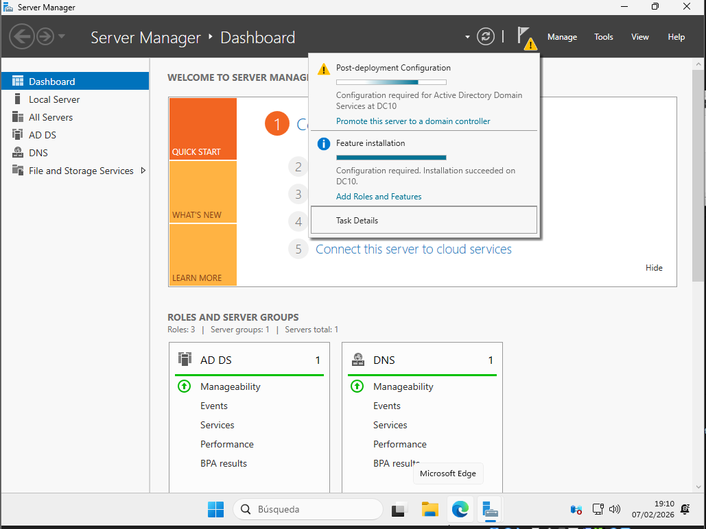
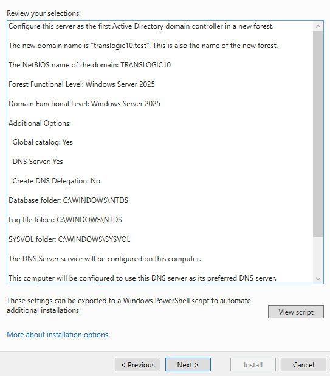
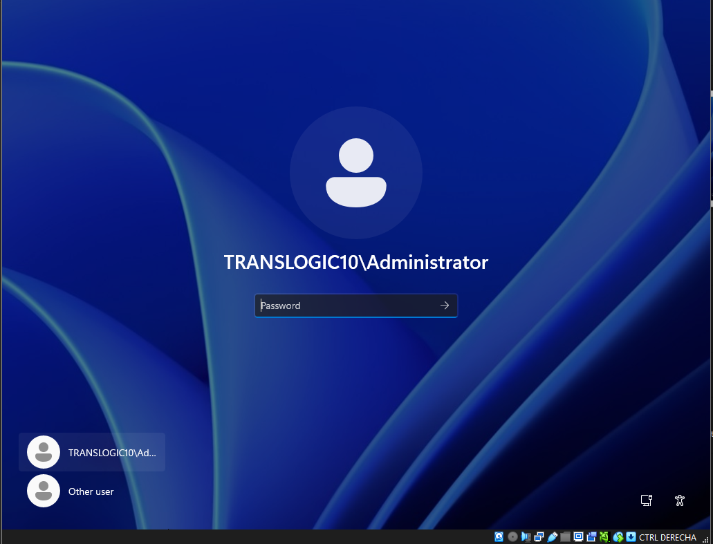

# T05 – Instalación del dominio en Windows Server 2025 (DC10)

**Alumno nº de lista:** 10  
**Servidor:** DC10  
**Dominio a crear:** `translogic10.test`  
**Entorno:** Máquina virtual en VirtualBox (continuación de T04)

---

## 1. Objetivo de la práctica

- Configurar correctamente **zona horaria y hora** del servidor.
- Configurar la red para que el **DNS del servidor apunte a sí mismo**.
- Instalar el **rol necesario**: Active Directory Domain Services (y DNS).
- Crear un **nuevo bosque y dominio**:
  - Nombre de dominio: `translogic10.test`
  - Nivel funcional del bosque y del dominio: **Windows Server 2025**
- Documentar la **pantalla de resumen** de la promoción a controlador de dominio.
- Guardar el **script PowerShell generado automáticamente** y subirlo al **repositorio**.
- Presentar la práctica con **formato correcto en Markdown**.

---

## 2. Configuración zona horaria y hora

Este apartado corresponde al criterio: **“Configuració correcta zona i hora”**.

1. Inicia sesión en el servidor como **Administrator**.
2. Haz clic derecho en la hora de la barra de tareas → **Adjust date and time**.
3. Configura:
   - **Time zone**: el que corresponda a España, por ejemplo:
     - `(UTC+01:00) Brussels, Copenhagen, Madrid, Paris`
   - Activa **Set time automatically** y **Set time zone automatically** si están disponibles.
4. Haz clic en **Sync now** (si aparece la opción) para sincronizar la hora.
5. Comprueba que:
   - La fecha es correcta.
   - La hora es correcta.
   - La zona horaria es la adecuada.

SE LO VUELVE A RECORDAR/HACER PORQUE ES MUY IMPORTANTE LA HORA
---

## 3. Configuración de red y DNS apuntando al propio servidor

Este apartado cubre el criterio: **“Conf. DNS apuntant-se a si mateix”**.

> Nota: Se asume que la interfaz **Host-only** será la usada para el tráfico interno del dominio.

1. Abre:
   - `Control Panel → Network and Sharing Center → Change adapter settings`
2. Identifica la interfaz que vas a usar para la LAN interna (normalmente algo como **Ethernet** o **Host-only**).
3. Haz clic derecho en esa interfaz → **Properties**.
4. Selecciona **Internet Protocol Version 4 (TCP/IPv4)** → **Properties**.
5. Configura una IP estática, por ejemplo:

   ```
   IP address:      192.168.56.10
   Subnet mask:     255.255.255.0
   Default gateway: (puede dejarse en blanco en la red interna)

6.  En la sección de DNS, configura:

    ```text
    Preferred DNS server: 192.168.56.10   (la IP del propio servidor)
    Alternate DNS server: (vacío o sin configurar)
    ```

7.  Acepta todos los diálogos con **OK**.



***

## 4. Instalación del rol necesario: AD DS y DNS

Este apartado cubre el criterio: **“Instal·lació Rol necessari”**.

1.  Abre **Server Manager**.
2.  Haz clic en **Manage → Add Roles and Features**.
3.  En el asistente:
    *   **Before you begin**: clic en **Next**.
    *   **Installation Type**: selecciona  
        `Role-based or feature-based installation` → **Next**.
    *   **Server Selection**: selecciona el servidor local (`DC10`) → **Next**.
    *   **Server Roles**:
        *   Marca **Active Directory Domain Services**.
        *   Acepta las características adicionales cuando lo pida.
        *   Marca también **DNS Server** si no está marcado.
4.  Haz clic en **Next** hasta la pantalla de confirmación.
5.  Haz clic en **Install**.
6.  Espera a que termine la instalación (no reinicia todavía).





> **Evidencia recomendada:** captura donde se vea que AD DS y DNS se han instalado correctamente en Server Manager.

***

## 5. Creación del dominio `translogic10.test` con nivel funcional 2025

Este apartado cubre los criterios:

*   **“Crear domini: nom correcte translogicXX.test”**
*   **“Crear domini: nivell funcional”**

Tras instalar AD DS, en la parte superior de Server Manager aparecerá una notificación amarilla.

### 5.1 Configuración del bosque y dominio

1.  En **Server Manager**, haz clic en la notificación amarilla.
2.  Selecciona **“Promote this server to a domain controller”**.
3.  En la ventana del asistente:

#### 5.1.1 Deployment Configuration

*   Selecciona: **Add a new forest**.
*   En **Root domain name**, escribe exactamente:

    ```text
    translogic10.test
    ```

> Revisar cuidadosamente el nombre: sin faltas, sin espacios, con el número 10.

#### 5.1.2 Domain Controller Options

*   **Forest functional level:** `Windows Server 2025`
*   **Domain functional level:** `Windows Server 2025`
*   Marca **DNS server** si no lo está ya.
*   Marca **Global Catalog (GC)** (debería venir activado por defecto).
*   Introduce una contraseña segura para **Directory Services Restore Mode (DSRM)**.


#### 5.1.3 Additional Options

*   Mantén las opciones por defecto.


#### 5.1.4 Paths

*   Deja las rutas por defecto:

    ```text
    Database folder: C:\Windows\NTDS
    Log files folder: C:\Windows\NTDS
    SYSVOL folder:   C:\Windows\SYSVOL
    ```



***

### 5.2 Pantalla resumen y captura

Este apartado cubre el criterio: **“Mostrar pantalla resum”**.

1.  El asistente mostrará una pantalla llamada **Review Options** (resumen).

2.  Comprueba que en el resumen aparece:
    *   Dominio raíz: `translogic10.test`
    *   Forest functional level: `Windows Server 2025`
    *   Domain functional level: `Windows Server 2025`
    *   DNS server seleccionado

3.  Haz una **captura de pantalla** de esta ventana.


***

### 5.3 Reinicio y primera sesión en el dominio

1.  En la pantalla final del asistente, haz clic en **Install**.
2.  El servidor realizará la promoción a controlador de dominio.
3.  Tras finalizar, el servidor se reiniciará automáticamente.
4.  En la pantalla de inicio de sesión, verifica que puedes iniciar sesión como:

    ```text
    TRANSLOGIC10\Administrator
    ```


***

## 6. Script generado y subida al repositorio

Este apartado cubre el criterio: **“Script: es mostra i existeix arxiu al repositori”**.

Durante el asistente de promoción a controlador de dominio, en la pantalla **Review Options**, está el botón:

```text
View Script
```

1.  Haz clic en **View Script**.

2.  Se abrirá un fichero de script en PowerShell con toda la configuración realizada.

3.  Haz clic en **File → Save As…**.

4.  Guarda el archivo con el nombre:

    ```text
    install-DC-translogic10.ps1
    ```

5.  Ruta recomendada en el servidor:

    ```text
    C:\Users\Administrator\Desktop\install-DC-translogic10.ps1
    ```
`RUTA DE ARCHIVO EN REPOSITORIO:`

[T05\install-DC-translogic10.ps1.txt](T05/install-DC-translogic10.ps1.txt)

El objetivo es que el script:

*   Se muestre en la práctica.
*   **Exista como archivo dentro del repositorio** (GitHub o similar).


## 7. Comprobaciones finales

1.  Abrir **Server Manager**:
    *   Comprobar que **AD DS** y **DNS** aparecen sin errores.
2.  Abrir **Active Directory Users and Computers**:
    *   Verificar que el dominio `translogic10.test` está creado.
3.  Verificar configuración DNS:
    *   La IP del servidor (por ejemplo `192.168.56.10`) tiene como DNS preferido **su propia IP**.

> **Evidencia opcional pero recomendable:**
>
> *   Captura de `Active Directory Users and Computers` mostrando `translogic10.test`.
> *   Captura de la configuración IPv4 con el DNS configurado a la IP del servidor.

***
