# T06 – Configuración del dominio (Active Directory)

**Alumno nº de lista:** 10
**Dominio:** translogic10.test
**Servidor:** DC10 (Windows Server 2025)
**Cliente:** PC1 (Windows 11)

---

## 1. Objetivo de la práctica

En esta práctica se configurará la **estructura lógica inicial del dominio** creado en la tarea T05.
Se trabajará sobre **Active Directory Domain Services (AD DS)** para crear y organizar:

* Unidades Organizativas (OU)
* Grupos de seguridad
* Plantillas de usuario
* Usuarios de prueba
* Carpetas personales (Home Folder)
* Un equipo cliente unido al dominio (PC1)

El objetivo es dejar el dominio **ordenado, funcional y preparado para crecer**, siguiendo buenas prácticas de administración para **TransLògic S.A.**

---

## 2. Acceso a Active Directory

En el servidor **DC10**:

1. Inicia sesión como:

   ```
   TRANSLOGIC10\Administrator
   ```
2. Abre:

   ```
   Server Manager → Tools → Active Directory Users and Computers
   ```
3. Comprueba que aparece el dominio:

   ```
   translogic10.test
   ```

---

## 3. Creación de la estructura de Unidades Organizativas (OU)

### 3.1 Estructura principal

```
translogic10.test
│
├── Empreses
│   ├── Gestio
│   ├── Magatzem
│   ├── Gerencia
│   └── Personal
│
└── Equips
```
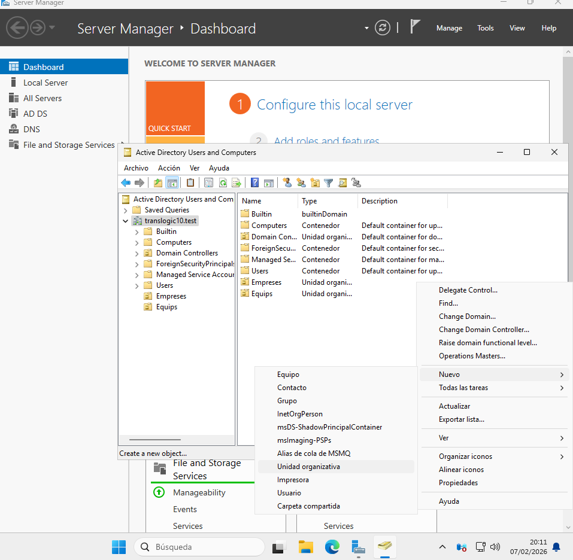
---

### 3.2 Creación paso a paso de las OU

Desde **Active Directory Users and Computers**:

1. Clic derecho sobre `translogic10.test` → **New → Organizational Unit**
2. Crear la OU raíz:

   ```
   Empreses
   ```
3. Dentro de **Empreses**, crear:

   * Gestio
   * Magatzem
   * Gerencia
   * Personal
4. En la raíz del dominio, crear:

   ```
   Equips
   ```

---

### 3.3 Justificación de la estructura

* **Empreses** agrupa toda la estructura corporativa.
* Cada OU representa un **departamento funcional**.
* **Personal** actúa como OU global para usuarios comunes del dominio.
* **Equips** separa los equipos de los usuarios, facilitando la gestión y futuras **GPO**.

---

## 4. Creación de grupos de seguridad

### 4.1 Crear los grupos

En la OU **Empreses**:

1. Clic derecho → **New → Group**
2. Crear los siguientes grupos:

| Nombre del grupo | Tipo     | Ámbito |
| ---------------- | -------- | ------ |
| gestio           | Security | Global |
| magatzem         | Security | Global |
| gerencia         | Security | Global |
| personal         | Security | Global |

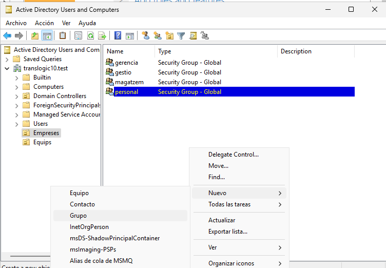
---

### 4.2 Pertinencia obligatoria de grupos

Los grupos principales deben ser miembros del grupo **personal**.

Para cada grupo (**gestio**, **magatzem**, **gerencia**):

1. Clic derecho → **Properties**
2. Pestaña **Member Of**
3. Add → escribir:

   ```
   personal
   ```
4. Aceptar

✔ Esto asegura que todos los usuarios pertenezcan al grupo común **personal**.

---

## 5. Configuración de la carpeta Home (carpeta personal)

### 5.1 Creación del recurso compartido

En el servidor **DC10**, usando el **segundo disco**:

1. Crear la carpeta:

   ```
   D:\Homes
   ```
2. Clic derecho → **Properties → Sharing → Advanced Sharing**
3. Marcar **Share this folder**
4. Share name:

   ```
   homes
   ```

#### Permisos de recurso compartido:

* **Administrators** → Full Control
* Eliminar: Users y Everyone

Aceptar cambios.

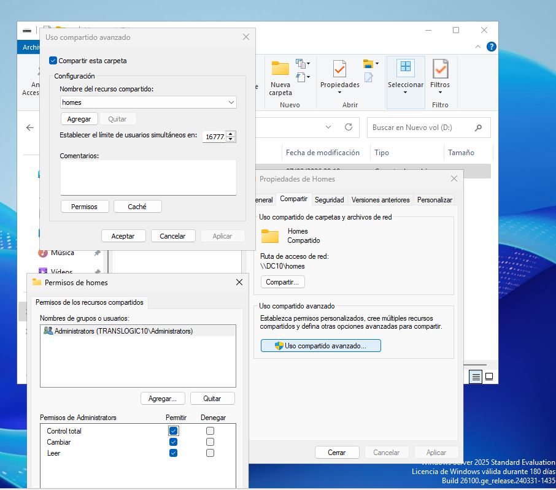

---

### 5.2 Permisos NTFS

En:

```
D:\Homes → Properties → Security → Advanced
```

Eliminar si existen:

* Users
* Authenticated Users

Añadir:

| Usuario / Grupo | Permisos                                 |
| --------------- | ---------------------------------------- |
| CREATOR OWNER   | Full Control (Subfolders and files only) |
| Administrators  | Full Control                             |
| SYSTEM          | Full Control                             |

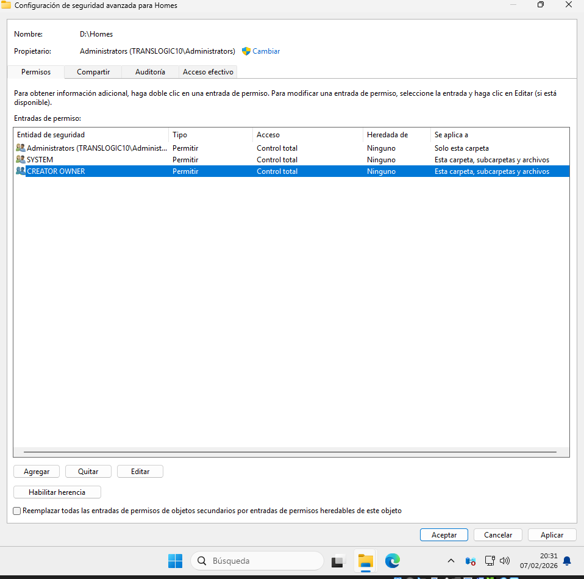
Aplicar correctamente **“This folder only”** o **“Subfolders and files only”** según corresponda.

---

### 5.3 Ruta del Home Folder

Para cada usuario:

```
\\DC10\homes\%username%
```
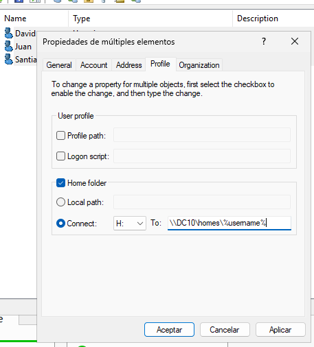
---

## 6. Creación de plantillas de usuario

### 6.1 Crear las plantillas

Crear **una plantilla en cada OU correspondiente**:

| OU       | Plantilla |
| -------- | --------- |
| Gestio   | _gestio   |
| Magatzem | _magatzem |
| Gerencia | _gerencia |

En este caso y lo mas comun todas deben empezar por **_**
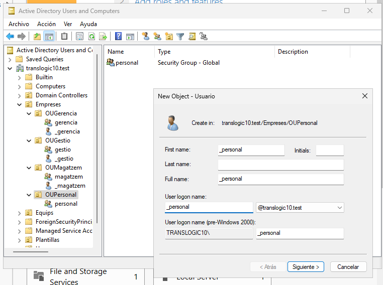
---

### 6.2 Configuración de cada plantilla

* Pertenencia a grupos:

  * Su grupo propio (gestio / magatzem / gerencia)
  * personal
* Carpeta personal:

  * Pestaña **Profile** → Home folder:

    ```
    Connect: H:
    To: \\DC10\homes\%username%
    ```
---

## 7. Creación de usuarios de prueba 

Crear un usuario en cada OU:

| Usuario    | OU       |
| ---------- | -------- |
| u_gestio   | Gestio   |
| u_magatzem | Magatzem |
| u_gerencia | Gerencia |

### Requisitos

* Crear usando **Copy** desde su plantilla
* Heredar: grupos y home folder
* Unidad H: correctamente asignada

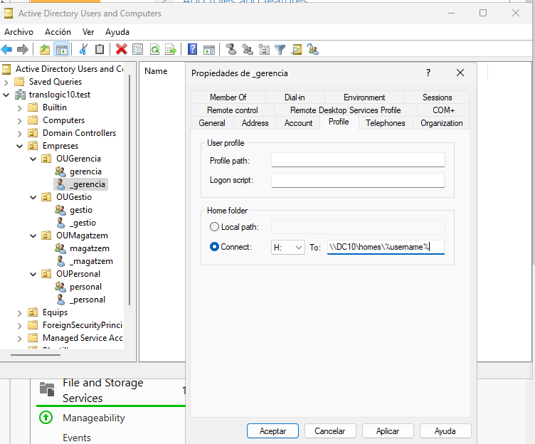

---

## 8. Preaprovisionar el equipo PC1 

En la OU **Equips**:

1. Clic derecho → **New → Computer**
2. Nombre:

   ```
   PC1
   ```
3. Opcional: asignar usuario **Administrator**
4. Aceptar

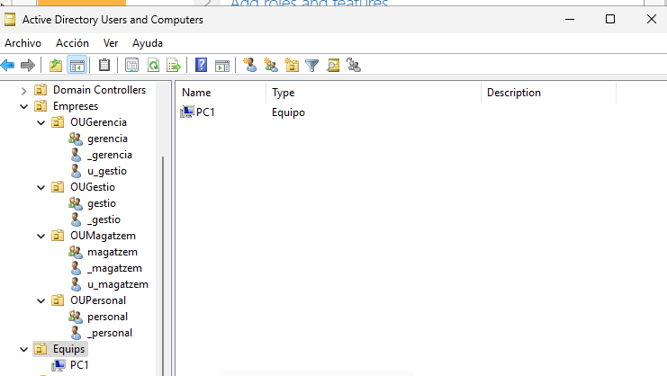

---

# 9. Creación y unión al dominio de Windows 11

## 9.1 Crear la VM Windows 11
- RAM: 4 GB  
- CPU: 1 o más  
- Disco: mínimo 64 GB  
- Red: NAT  
- Instalar Windows 11 normalmente con usuario local temporal.

> **Importante:** Solo las ediciones **Windows 11 Pro, Enterprise o Education** pueden unirse a un dominio.  
> Windows 11 Home **no es compatible**.  
> Para verificar la edición instalada desde PowerShell:
```
systeminfo | findstr /B /C:"OS Name"
````

* Resultado esperado: `Windows 11 Pro`, `Windows 11 Enterprise` o `Windows 11 Education`.

---

## 9.2 Unir PC1 al dominio

### Paso 1: Cambiar nombre del equipo

Abrir PowerShell como Administrador y ejecutar:

```
Rename-Computer -NewName "PC1" -Restart
```
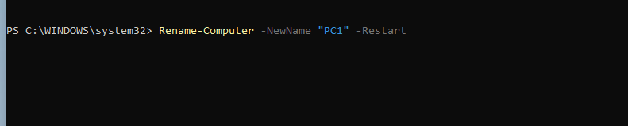

* Esto reiniciará el PC automáticamente y establecerá el nombre local como `PC1`.

### Paso 2: Configurar DNS para que apunte al controlador de dominio

Primero, identificar el adaptador de red correcto:

```
Get-NetAdapter
```

Luego configurar el DNS (ejemplo si el DC tiene IP `192.168.56.10` y el adaptador se llama `Ethernet`):

```
Set-DnsClientServerAddress -InterfaceAlias "Ethernet" -ServerAddresses 192.168.56.10
```

### Paso 3: Verificar conectividad con el dominio


# Probar resolución del dominio
nslookup translogic10.test

# Probar conectividad al DC
ping 192.168.56.10

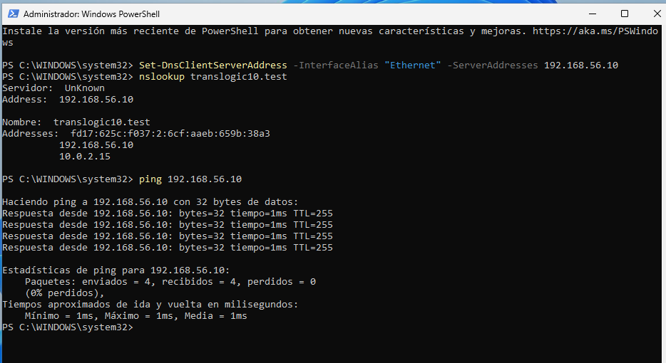

### Paso 4: Unir al dominio

```
Add-Computer -DomainName "translogic10.test" -Credential "Administrator" -Restart
```
* Introducir la **contraseña correcta del Administrator del dominio** cuando se solicite.
* El PC se reiniciará automáticamente y quedará unido al dominio.


### Paso 5: Verificar que la unión fue exitosa


# Comprobar que el PC pertenece al dominio
(Get-ComputerInfo).CsDomain

# Comprobar nombre del PC
```
hostname
```

Debe mostrar:

```
translogic10.test
PC1
```
Nada mas reiniciar:

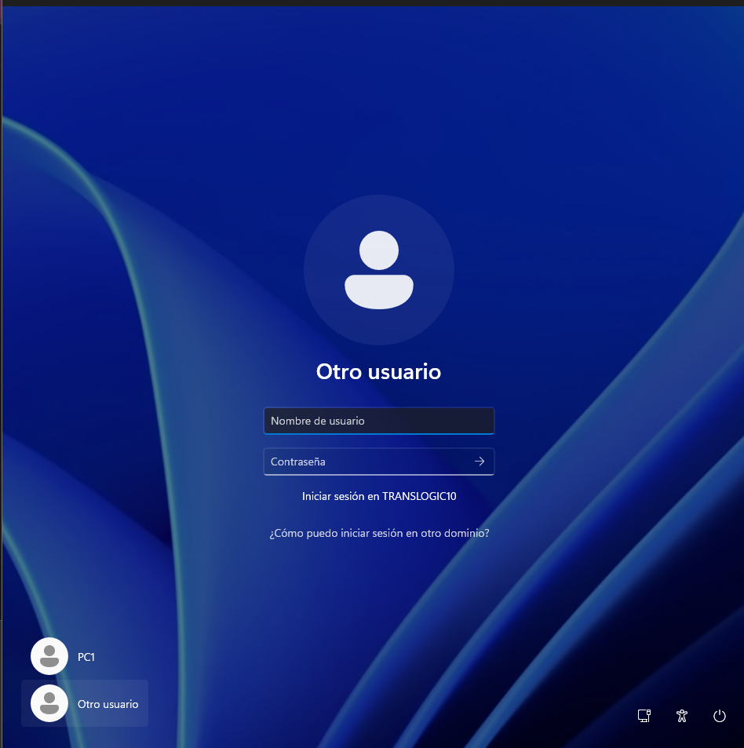

Muestra de dominio:

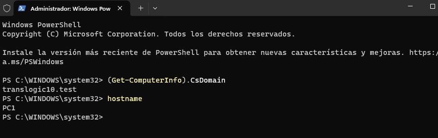

Gestion desde el server:

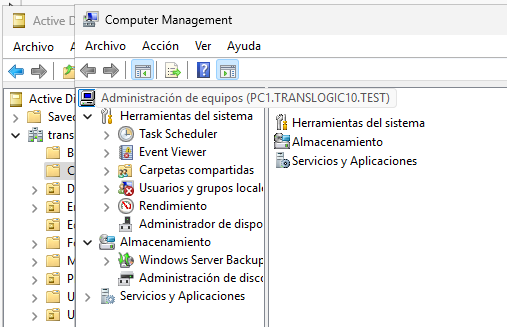
---


## 10. Prueba de acceso con los usuarios (2 puntos)

En **PC1**:

1. Cerrar sesión del usuario local
2. Probar inicio de sesión con:

   * David
   * Juan
   * Santiago

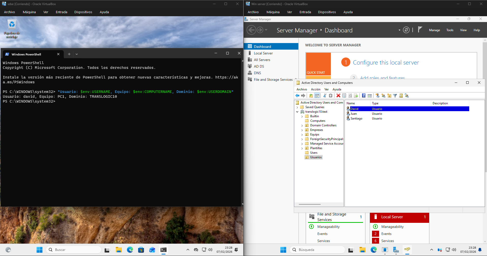
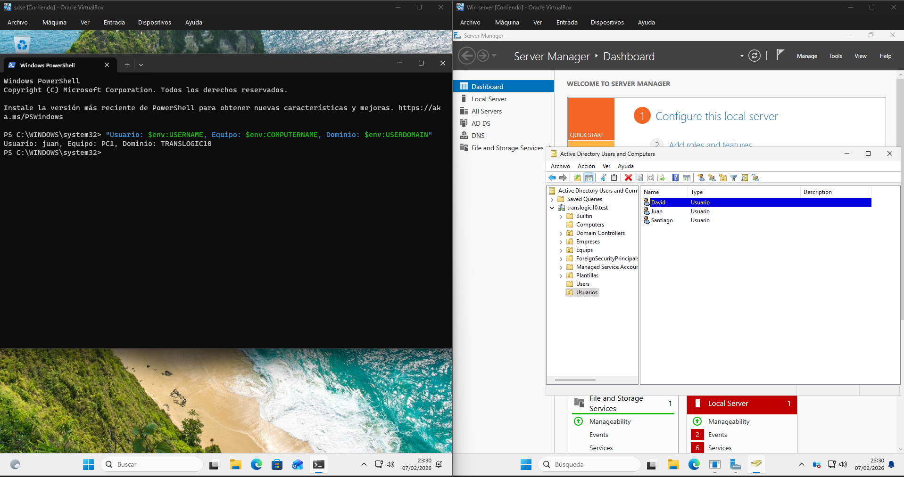
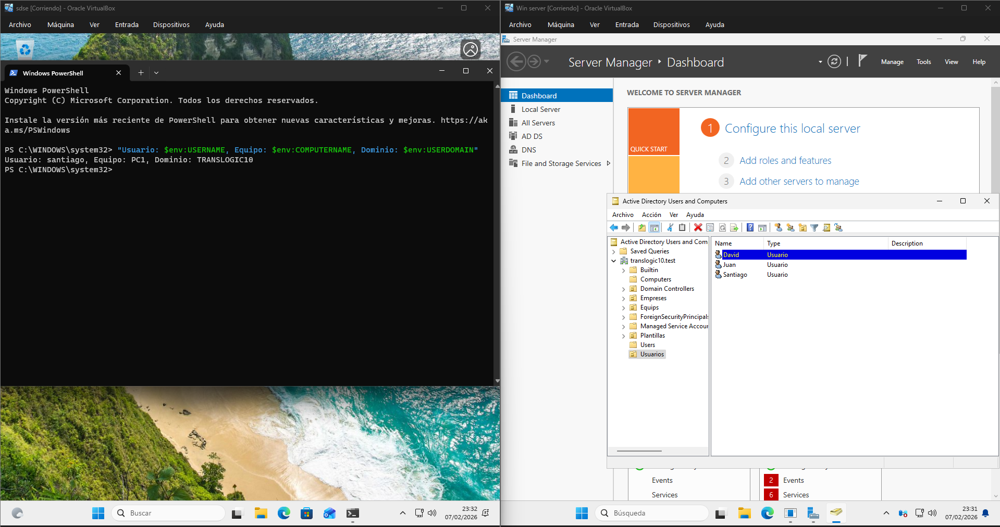

### Verificaciones

* Inicio correcto
* Aparece unidad **H:**
* Acceso solo a su carpeta personal
* No acceso a carpetas de otros usuarios

Carpetas creadas en el disco y muestra de que no pueden acceder a carpetas de otros usuarios:
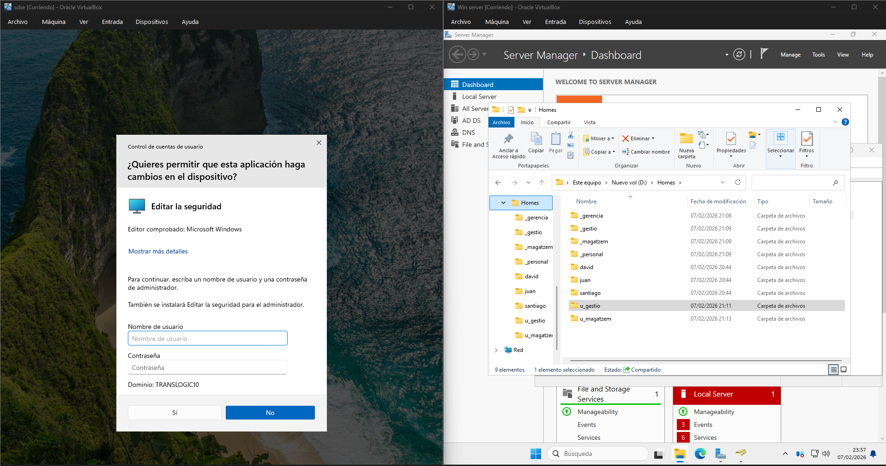
