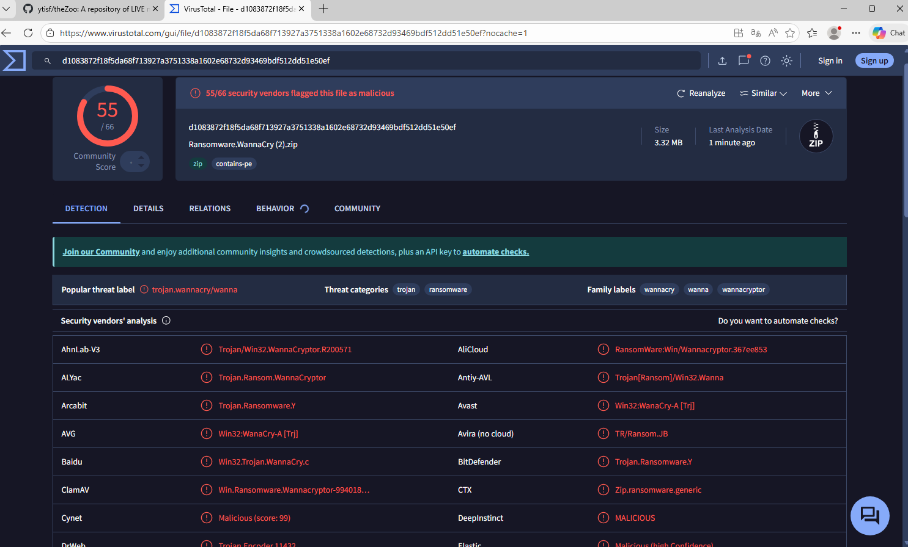

# Guía rápida: Análisis estático de malware en laboratorio

## 1. Preparación del archivo
- Se trabaja siempre dentro de una máquina virtual aislada.  
- La carpeta que contiene el archivo malicioso se comprime en formato ZIP.  
- No se utiliza contraseña para permitir que los motores antivirus puedan inspeccionar el contenido.  
- El ZIP actúa como un contenedor que evita ejecuciones accidentales.

## 2. Análisis en VirusTotal
- Se sube el archivo ZIP a la plataforma VirusTotal.  
- El sistema analiza el contenido utilizando múltiples motores antivirus.  
- Se revisan los resultados obtenidos:

  - Número de motores que detectan el archivo como malicioso  
  - Nombres asignados a la amenaza  
  - Hashes y metadatos generados  
  - Información heurística o firmas asociadas  

## 3. Análisis con Kaspersky
- Dentro de la máquina virtual, se analiza el ZIP con Kaspersky.  
- El motor examina el contenido sin necesidad de extraerlo.  
- Se observa:

  - Si detecta la amenaza  
  - Qué clasificación asigna  
  - Nivel de severidad y acciones recomendadas  

## 4. Comparación de resultados

| Aspecto | VirusTotal | Kaspersky |
|---------|------------|-----------|
| Motores utilizados | Muchos | Uno |
| Nivel de detalle | Alto | Enfocado en acción |
| Detección en ZIP | Sí | Sí |

## 5. Conclusión
La práctica permite comprender cómo se realiza un análisis estático seguro, cómo distintos motores clasifican un mismo archivo y por qué el ZIP sin contraseña facilita la inspección sin riesgo de ejecución.
