# Guía de la práctica 1
## Verificación del funcionamiento del antimalware mediante el archivo EICAR
### 1. Introducción
En esta práctica se verifica el funcionamiento del antivirus del sistema operativo mediante el uso del archivo de prueba EICAR. Este archivo no es un malware real, sino un fichero estándar utilizado para comprobar que las soluciones antimalware detectan correctamente una amenaza sin poner en riesgo el sistema.

El objetivo de la práctica es observar el comportamiento de las diferentes capas de protección del sistema, incluyendo el navegador web, el sistema operativo y el antivirus, durante la descarga, extracción y manipulación del archivo EICAR en distintos formatos comprimidos.

### 2. Advertencias previas y consideraciones
Esta práctica debe realizarse únicamente en una máquina virtual o entorno de pruebas.
No se utiliza malware real. El archivo EICAR es un estándar seguro.
El antivirus detectará y eliminará los archivos cuando la protección esté activa; este comportamiento es normal.
Algunas protecciones deben desactivarse temporalmente para poder realizar las pruebas y deben reactivarse al finalizar cada fase.
No se debe ejecutar ni abrir el archivo EICAR; únicamente se trabaja con su descarga, extracción y compresión.

### 3. Procedimiento paso a paso
#### 3.1 Desactivación de SmartScreen y protección basada en la reputación y el Edge
- Abrir edge y en configuraacion... privacidad,busqueda y servicios... DESACTIVAR la opcion de " Protegerse de descargas y sitios dañinos "

- Abrir Seguridad de Windows.
- Acceder a Control de aplicaciones y navegador.
- Entrar en Protección basada en la reputación.

Desactivar temporalmente las siguientes opciones:

- Comprobar aplicaciones y archivos.
- SmartScreen para Microsoft Edge.
- Bloqueo de aplicaciones potencialmente no deseadas (PUA).
- Cerrar la ventana de configuración.

#### 3.2 Desactivación temporal de Windows Defender

- Abrir Seguridad de Windows.
- Acceder a Protección antivirus y contra amenazas.
- Seleccionar Administrar la configuración.

Desactivar temporalmente:

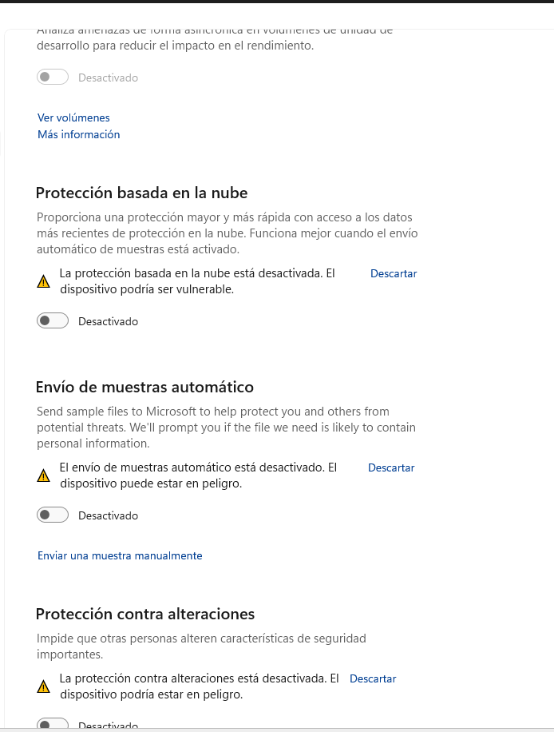

- Protección en tiempo real.
- Protección basada en la nube.
- Envío automático de muestras.

En caso de que el sistema reactive automáticamente estas opciones, desactivar también Protección contra alteraciones (Tamper Protection).

#### 3.3 Descarga del archivo de prueba EICAR

- Acceder al sitio web https://www.eicar.org
- Localizar la sección de archivos de prueba.
- Descargar el archivo eicar_com.zip.

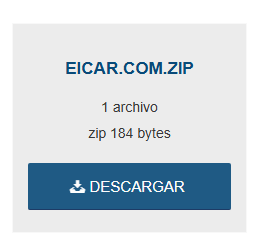

- Guardar el archivo en el escritorio de la máquina virtual.

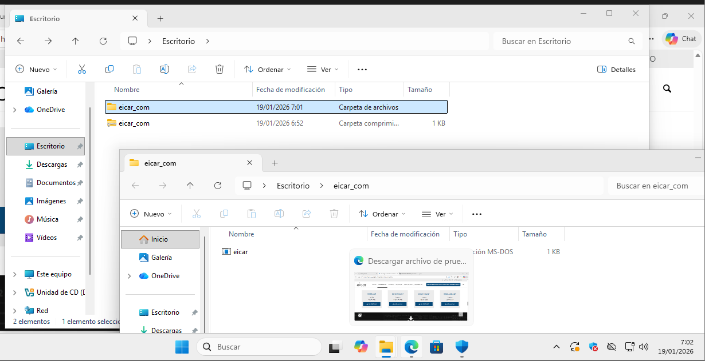

Nota: Si el navegador bloquea la descarga, comprobar que SmartScreen esté desactivado. En caso de que el archivo se abra como texto en el navegador, copiar manualmente su contenido y guardarlo en un archivo llamado eicar.com.

#### 3.4 Extracción del archivo EICAR

Con el antivirus desactivado, hacer clic derecho sobre eicar_com.zip.
- Seleccionar Extraer aquí o Extraer en carpeta.
- Confirmar que aparece el archivo eicar.com.

#### 3.5 Reactivación de Windows Defender

- Volver a Seguridad de Windows.

Activar nuevamente:

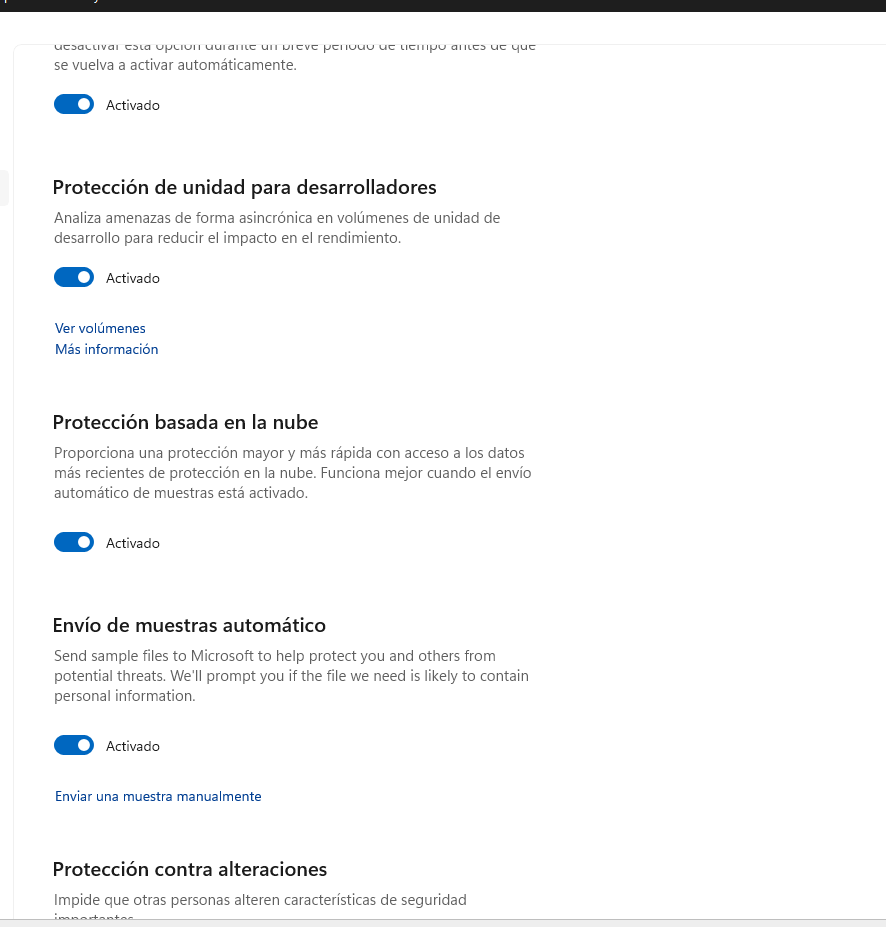
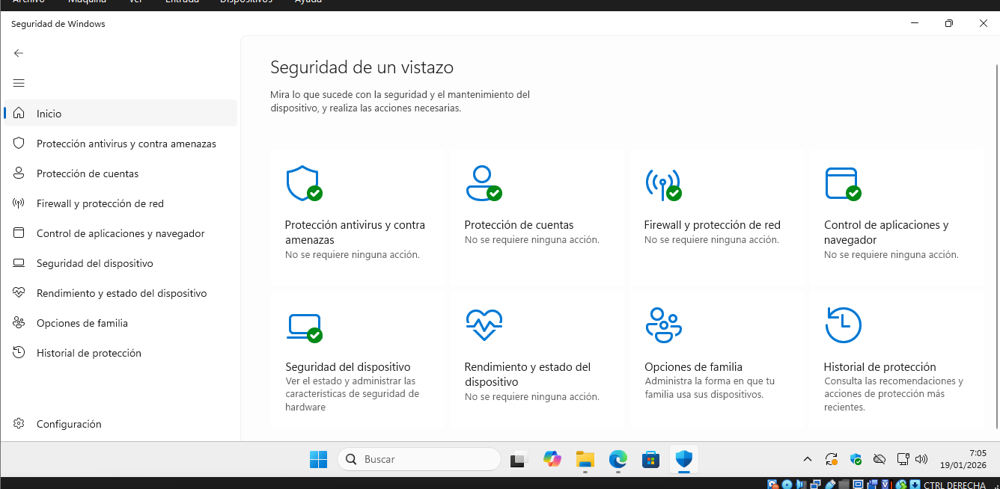

- Protección en tiempo real.
- Protección basada en la nube.
- Envío automático de muestras.
- Activar también Protección contra alteraciones (Tamper Protection).

#### 3.6 Comprobación de la detección del archivo EICAR

- Abrir la carpeta donde se encuentra el archivo eicar.com.
- Esperar unos segundos.
- Windows Defender debería detectar el archivo y eliminarlo automáticamente.
- Para confirmar la detección, acceder a:
- Seguridad de Windows → Protección antivirus y contra amenazas → Historial de protección.
- Registrar el mensaje y la acción realizada por el antivirus.
### - O puede pasar que no lo detecte pero una practica buena es al descargar algo de un lugar desconfiado es que con el click derecho sobre el archivo y darle a la opcion Examinar con el Windows defender.

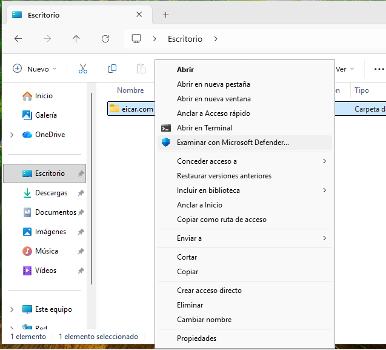

- y en caso de tener algo dañino se lo enviara al historial y alli podremos decidir que hacer con el, como restaurar, eliminar, o enviar a cuarentena.

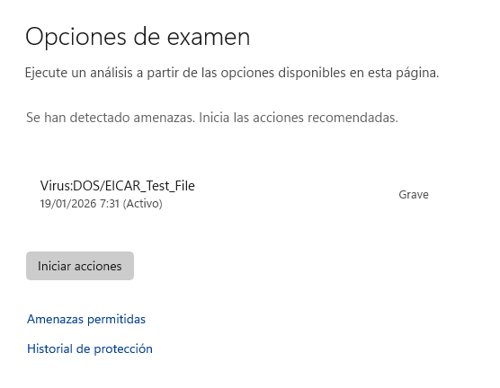

#### 3.7 Prueba con archivos comprimidos en distintos formatos
#### 3.7.1 Preparación de los archivos

- Desactivar nuevamente la protección en tiempo real.

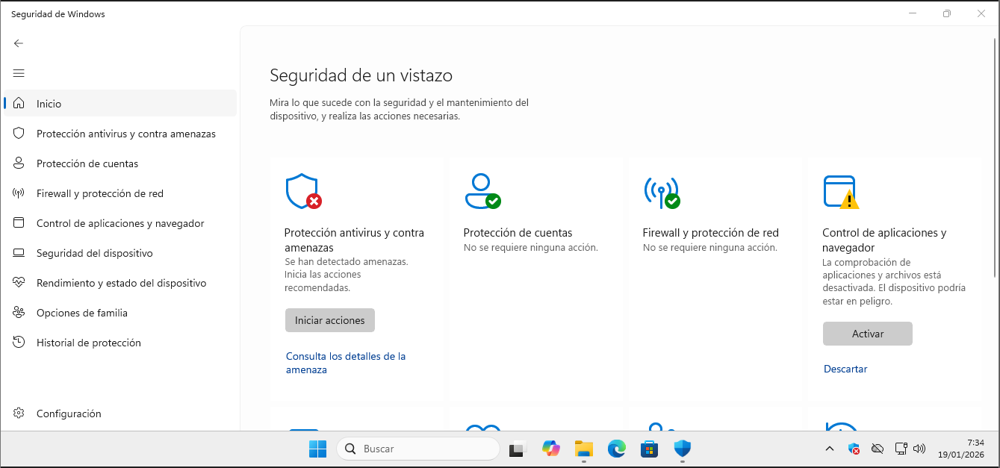

- Restaurar el archivo eicar.com desde la cuarentena o repetir la extracción desde el ZIP original.
Crear los siguientes archivos comprimidos:

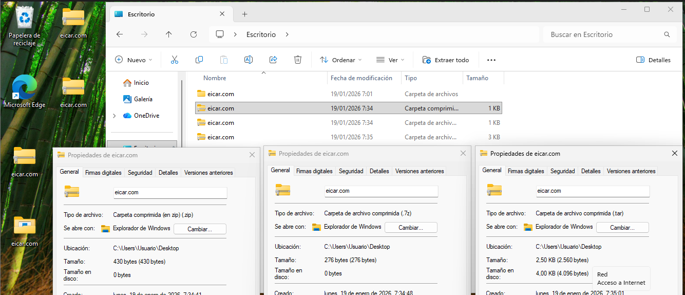

- ZIP: clic derecho → Enviar a → Carpeta comprimida.
- TAR: clic derecho → 7-Zip → Añadir al archivo → Formato TAR.
- 7Z: clic derecho → 7-Zip → Añadir al archivo → Formato 7Z.

#### 3.7.2 Reactivación del antivirus y comprobación de detecciones

- Activar nuevamente la protección en tiempo real.
- Abrir cada archivo comprimido y observar si el antivirus detecta la amenaza.
- En caso de no detectarla al abrir el archivo, extraerlo y comprobar si se detecta durante la extracción.
- Registrar el comportamiento del antivirus en cada formato.

Comportamiento esperado:
- El formato ZIP suele detectarse de forma inmediata.
- El formato TAR puede detectarse al abrir o al extraer.
- El formato 7Z puede requerir la extracción para que el antivirus actúe.

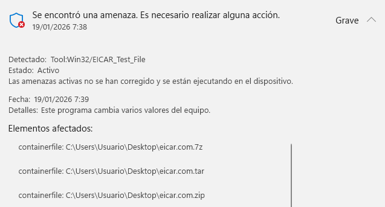

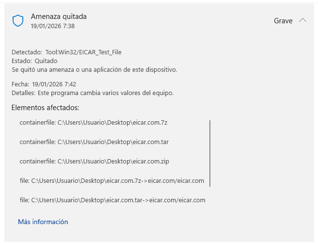

### 4. Conclusión

Esta práctica permite comprobar el correcto funcionamiento del antimalware integrado en Windows 11 y entender cómo actúan las distintas capas de protección frente a amenazas, incluso cuando estas se encuentran ocultas dentro de archivos comprimidos. El uso del archivo EICAR facilita la realización de pruebas de forma segura y controlada.
