# Sistemas de protección en Windows 11
### 1. Objetivo de la práctica
El objetivo de esta práctica es comprobar el funcionamiento de las protecciones de seguridad de Windows 11, en concreto las relacionadas con la protección contra ransomware, observando el comportamiento del sistema cuando dichas protecciones están desactivadas y cuando se encuentran activas.

### 2. Preparación del entorno
- El sistema Windows 11 tiene activadas todas las protecciones de Windows Defender por defecto.
- Se accedió a la carpeta Documentos del usuario.
- Se crearon tres archivos de texto llamados `prueba1.txt`, `prueba2.txt` y `prueba3.txt`.
- Estos archivos se utilizaron para comprobar el cifrado y descifrado provocado por el script de prueba.

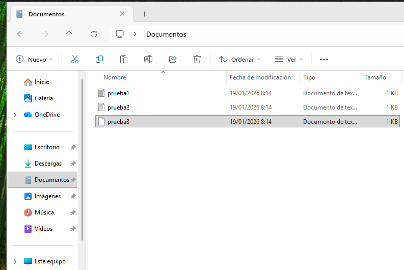

### 3. Desactivación de la protección contra ransomware
- Se abrió Seguridad de Windows.
- Se accedió al apartado Protección contra ransomware.
- Se comprobó que el Acceso controlado a carpetas estaba activado.
- Se desactivó el Acceso controlado a carpetas para permitir el cifrado de archivos.

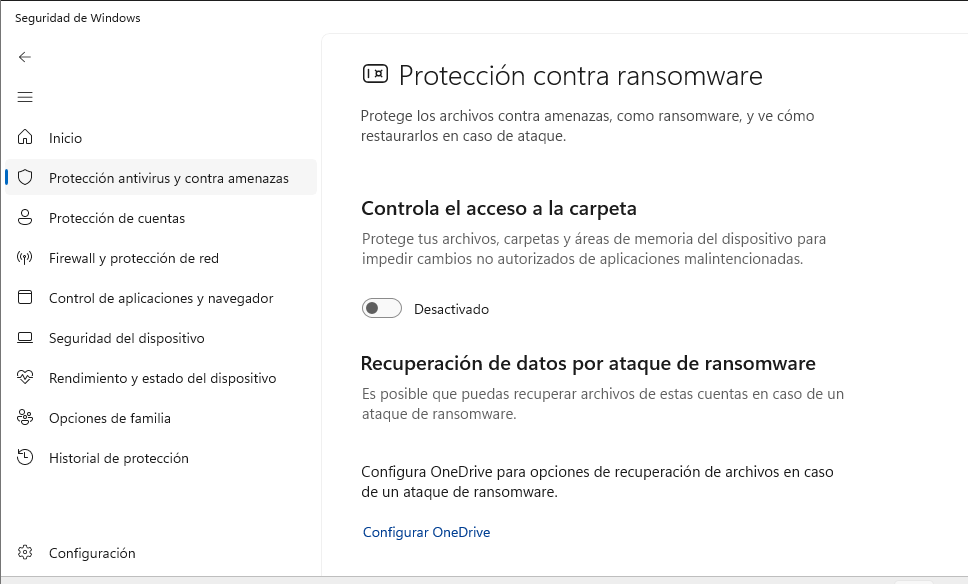

### 4. Preparación de PowerShell para la ejecución del script
- Se abrió PowerShell como administrador.

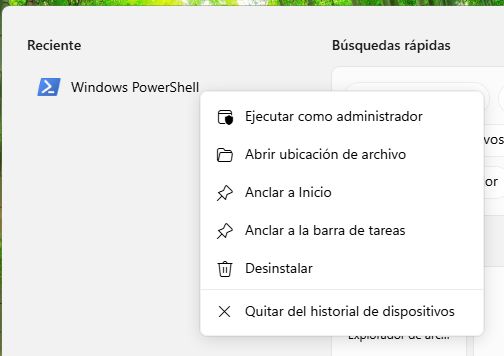

- Se ejecutó el siguiente comando para permitir la ejecución de scripts:
```
Set-ExecutionPolicy -ExecutionPolicy unrestricted
```

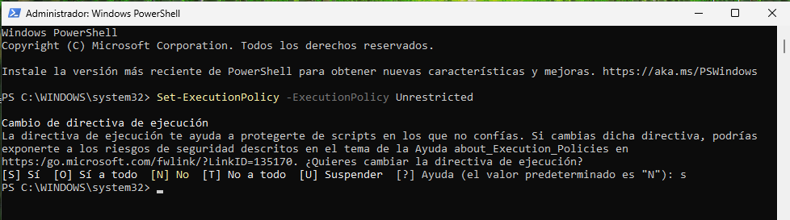

- Se confirmó el cambio pulsando la tecla `S` y después `Enter`.

### 5. Desactivación de las protecciones del antivirus
- Se volvió a Seguridad de Windows.
- Se accedió a Protección antivirus y contra amenazas.
- Se desactivaron todas las opciones disponibles en este apartado para evitar bloqueos durante la prueba.

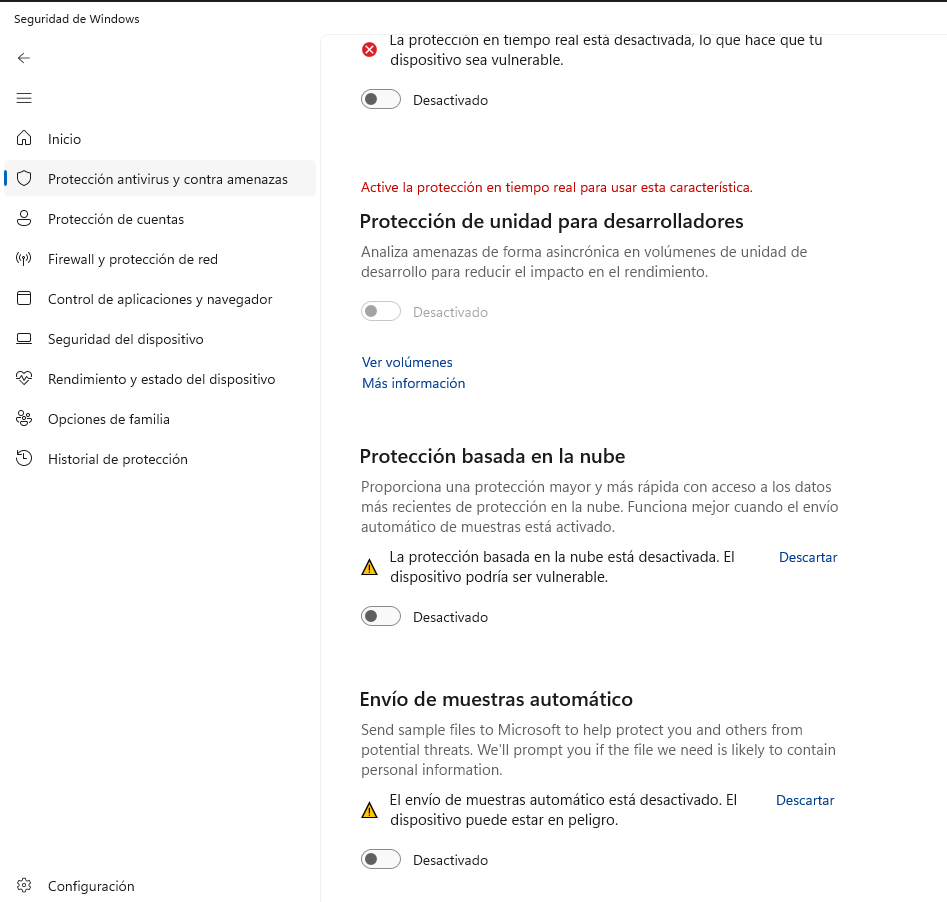

### 6. Descarga y preparación del script PSRansom
- Se abrió el navegador Microsoft Edge.
- Se accedió al repositorio:
```
https://github.com/JoelGMSec/PSRansom
```

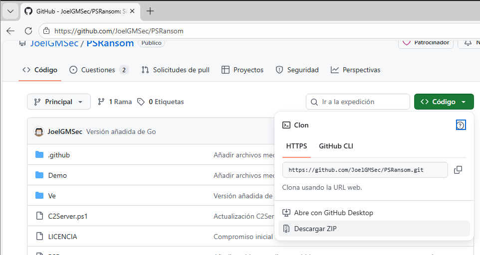

- Se descargó el contenido del repositorio.

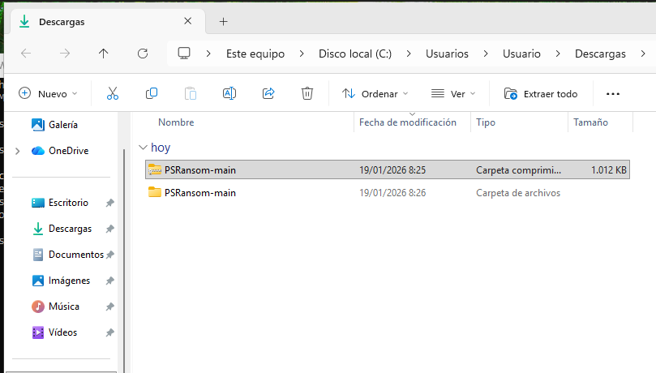

- La carpeta descargada se extrajo en el Escritorio.

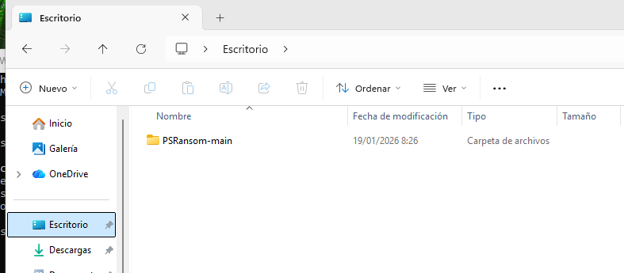

### 7. Ejecución del script con las protecciones desactivadas
- Se abrió una ventana de CMD en la ruta de la carpeta extraída:
```
C:\Users\Usuario\Desktop\PSRansom-main
```

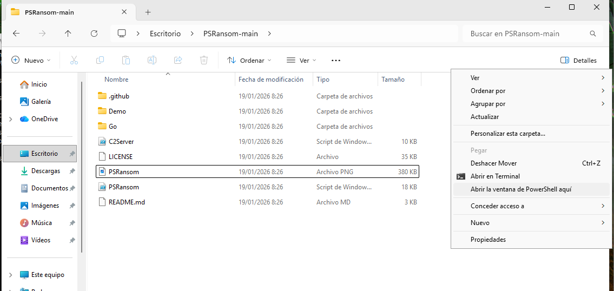

- Se ejecutó el siguiente comando:
```
.\PSRansom.ps1 -e C:\Users%USERNAME%\Documents -s 127.0.0.1 -p 80 -x
```

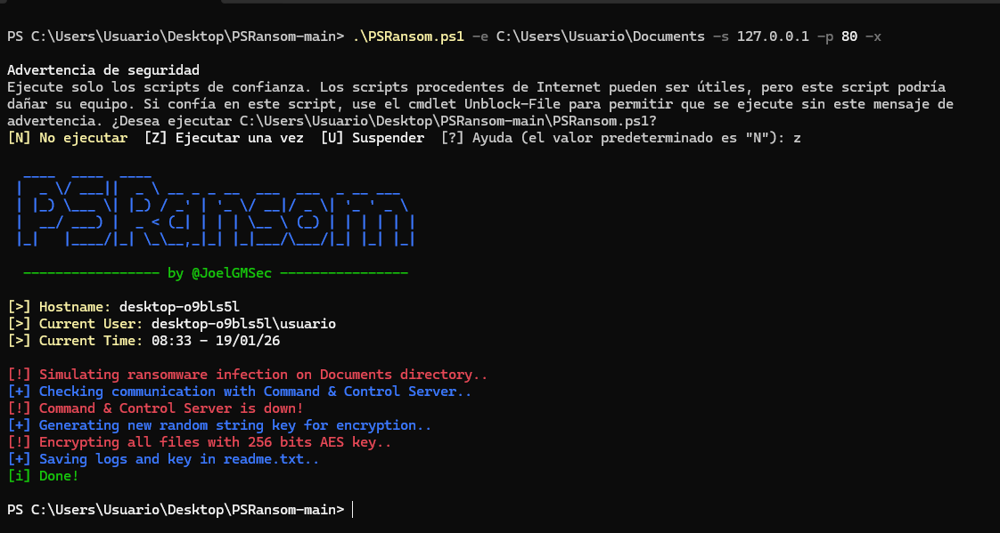

- Se confirmó la ejecución pulsando la tecla `Z` y luego `Enter`.
- Se accedió a la carpeta Documentos.
- Se comprobó que los archivos de texto habían sido cifrados.

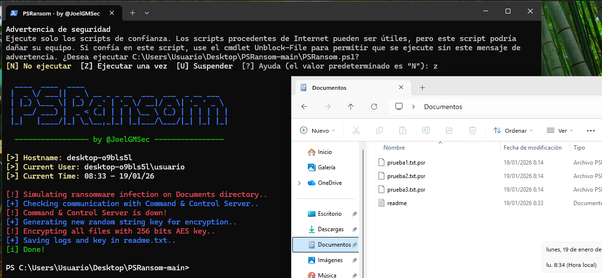

- Se observó la creación de un archivo `README.md` que contenía la clave de recuperación e indicaba que los archivos habían sido encriptados.

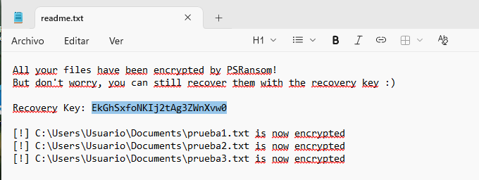

### 8. Descifrado de los archivos
- Se copió la clave de recuperación indicada en el archivo `README.md`.
- En la misma ventana de CMD se ejecutó el siguiente comando:
```
.\PSRansom.ps1 -d C:\Users%USERNAME%\Documents -k CLAVE_COPIADA
```

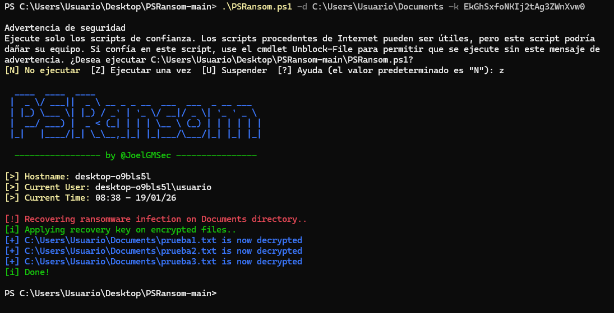

- Se volvió a confirmar pulsando la tecla `Z` y después `Enter`.
- Se comprobó que los archivos volvían a estar accesibles y sin cifrar.
- El archivo `README.md` desapareció automáticamente.

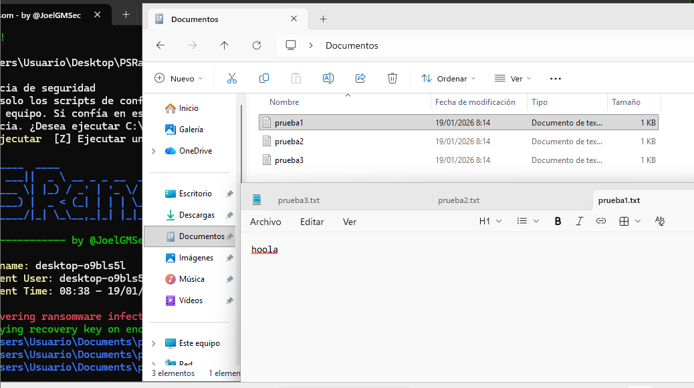

### 9. Activación de las protecciones y comprobación final
- Se volvió a Seguridad de Windows.
- Se activaron todas las opciones del apartado Protección antivirus y contra amenazas.

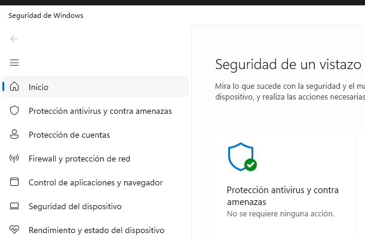

- Se volvió a ejecutar el comando de cifrado utilizado anteriormente.
- En esta ocasión, Windows Defender bloqueó la acción.
- Se generó una alerta de seguridad indicando el intento de comportamiento tipo ransomware.
- En el Historial de protección se pudo comprobar la detección y las opciones de acción disponibles.

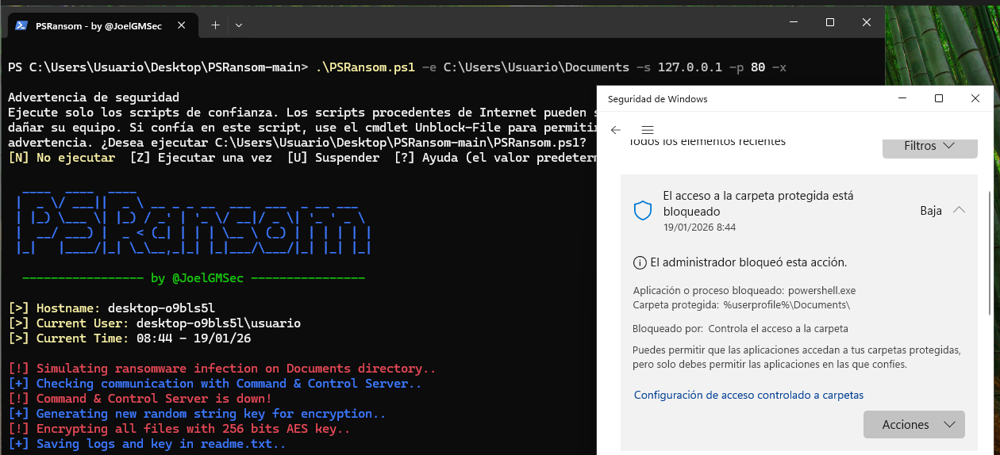

### 10. Conclusión
Esta práctica demuestra la eficacia de las protecciones de Windows 11 frente a ataques de tipo ransomware. Cuando las defensas están desactivadas, el sistema es vulnerable al cifrado de archivos, mientras que al reactivar las protecciones, el comportamiento malicioso es detectado y bloqueado correctamente por Windows Defender.
