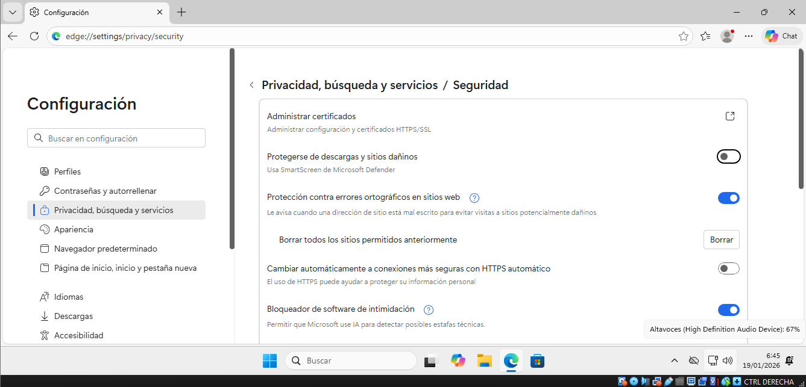

# Sistemas de protección en Windows 11
### 1. Objetivo de la práctica
El objetivo de esta práctica es identificar y revisar las diferentes protecciones de seguridad integradas en Windows 11, comprobando su estado y funcionamiento dentro de la aplicación Seguridad de Windows.

### 3. Acceso a la seguridad del sistema
- Iniciar Windows 11.
- Abrir el menú Inicio.
- Buscar y abrir Seguridad de Windows.
- Desde esta aplicación se gestionan todas las funciones de seguridad del sistema operativo.

4. Protección antivirus y contra amenazas
Dentro de Seguridad de Windows, acceder a Protección antivirus y contra amenazas.
Comprobar el estado general del sistema y verificar que no existen alertas activas.
Acceder a Administrar la configuración.
En este apartado se revisan las siguientes protecciones:
Protección en tiempo real.
Protección basada en la nube.
Envío automático de muestras.
Protección contra alteraciones.
Opciones de examen del sistema (rápido, completo y personalizado).
Historial de protección.
Verificar que todas las protecciones están activadas.
Confirmar que los cambios de configuración se reflejan correctamente en el estado de seguridad.

5. Control de aplicaciones y navegador
Volver al menú principal de Seguridad de Windows.
Acceder a Control de aplicaciones y navegador.
En esta sección se revisan las siguientes opciones:
Microsoft Defender SmartScreen para navegación web y descargas.
Protección contra aplicaciones potencialmente no deseadas.
Protección contra exploits.
Aislamiento del núcleo.
Integridad de memoria.
Comprobar que las protecciones recomendadas están activadas.
Revisar los mensajes informativos y advertencias del sistema.

6. Protección contra ransomware
Desde Seguridad de Windows, acceder a Protección contra ransomware.
Comprobar el estado del Acceso controlado a carpetas.
En este apartado se revisa:
Qué carpetas están protegidas por defecto.
Cómo permitir aplicaciones legítimas.
Opciones de recuperación de archivos mediante copia de seguridad.
Activar o verificar que el acceso controlado a carpetas esté habilitado.
Confirmar que la carpeta Documentos se encuentra protegida.

7. Verificación del estado de seguridad
Revisar el panel principal de Seguridad de Windows.
Confirmar que el sistema muestra estado protegido (sin alertas críticas).
Verificar que todas las protecciones revisadas en la práctica se encuentran activas.

8. Conclusión
Windows 11 incorpora un conjunto completo de herramientas de seguridad que permiten proteger el sistema frente a malware, aplicaciones maliciosas y ransomware. A través de la aplicación Seguridad de Windows es posible configurar, revisar y comprobar el estado de todas estas protecciones, garantizando un entorno de trabajo más seguro.
