# Guía práctica 3

## Prueba práctica de ransomware: WannaCry

## 1. Preparación del entorno

- Se inició la máquina virtual con Windows 11.
- Antes de realizar cualquier acción, se creó una **instantánea (snapshot)** de la máquina virtual con el nombre *“Antes del virus”*, para poder restaurar el sistema al finalizar la práctica.
- Se tomaron medidas de aislamiento para evitar cualquier propagación:

   * Desconexión de la interfaz de red de la máquina virtual.
   * Eliminación o desactivación de carpetas compartidas.
   * Uso exclusivo de la máquina virtual para la práctica, sin acceso a equipos reales.

## 2. Descarga del malware WannaCry

- Se accedió al repositorio de GitHub:
   [https://github.com/ytisf/theZoo](https://github.com/ytisf/theZoo)
- Se pulsó el botón **Code** (verde) y se descargó el repositorio completo en formato comprimido.

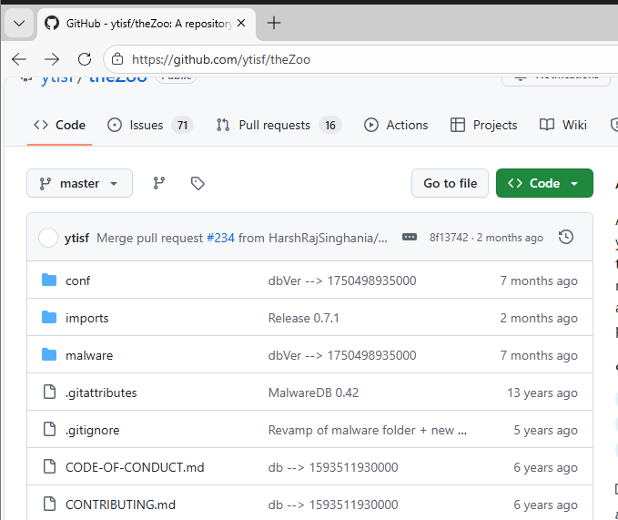

- Una vez descargado el archivo, se localizó dentro de las carpetas comprimidas el directorio correspondiente a **Ransomware.WannaCry**.

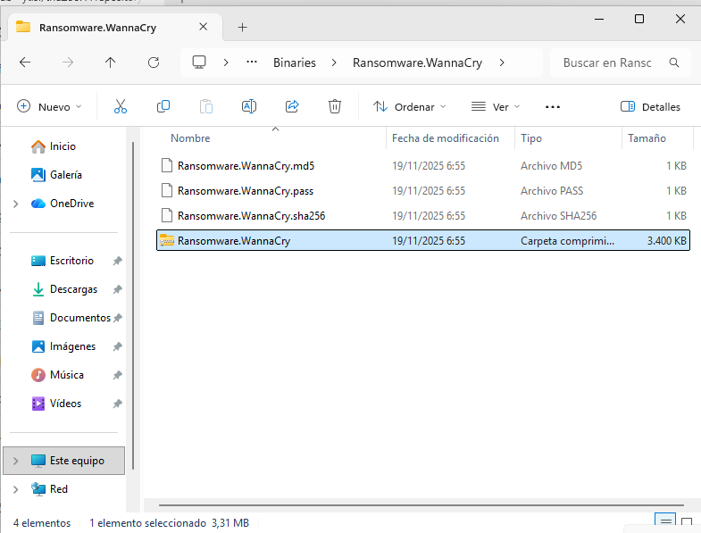

## 3. Primer intento de extracción con Windows Defender activo

- Se intentó descomprimir la carpeta **Ransomware.WannaCry**.
- Durante el intento de extracción, **Windows Defender bloqueó la acción**.
- Apareció una notificación indicando que **se habían encontrado amenazas** y que la extracción no se podía completar por motivos de seguridad.

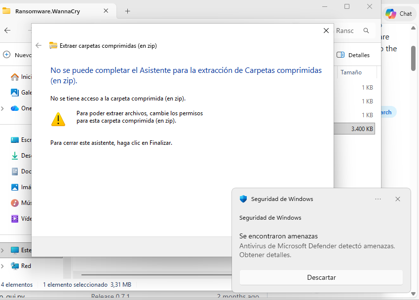

- Se cerraron las notificaciones y la ventana de error de extracción.

Este comportamiento confirma que el antivirus detecta el malware y evita su ejecución por defecto.

## 4. Desactivación de las protecciones de Windows Defender

- Se abrió **Seguridad de Windows**.
- Se accedió a **Protección antivirus y contra amenazas**.
- Se desactivó la **protección en tiempo real**.

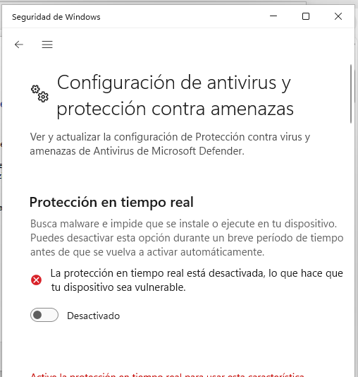

- Para asegurar la ejecución del malware, se desactivaron el resto de protecciones activas de Windows Defender.

> Nota: Para que la práctica funcione correctamente, yo ya las tenia pero las protecciones que normalmente deben desactivarse son:
>
> * Protección en tiempo real
> * Protección basada en la nube
> * Envío automático de muestras
> * Protección contra alteraciones (si es posible)

## 5. Extracción del ransomware WannaCry

- Se volvió a intentar la extracción de la carpeta **Ransomware.WannaCry**.
- Esta vez se abrió correctamente la ventana de extracción.
- El sistema solicitó una contraseña para descomprimir el contenido.
- Se introdujo la contraseña **infected**.
- Se eligió el **Escritorio** como ubicación de extracción.
- El contenido se extrajo correctamente sin que Windows Defender lo bloqueara.
   
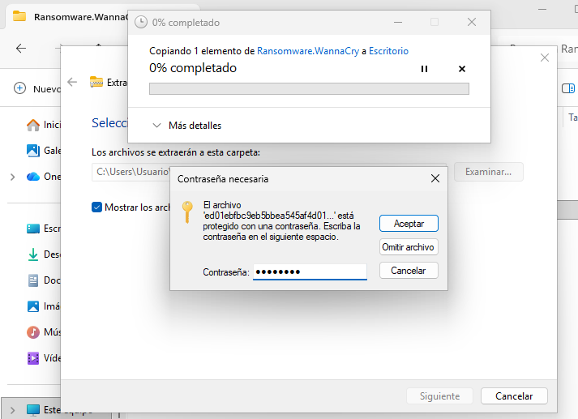

## 6. Ejecución del ransomware WannaCry

- Se verificó nuevamente que la máquina virtual seguía aislada de la red.

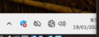

- Se ejecutó el archivo ejecutable de WannaCry.
- Tras la ejecución, se observaron cambios en el sistema:

   * Archivos cifrados.
   * Modificaciones visibles en el entorno del sistema.
- El programa principal de WannaCry (ventana de negociación del rescate) fue eliminado automáticamente por Windows Defender, a pesar de que aparentemente todas las protecciones estaban desactivadas.

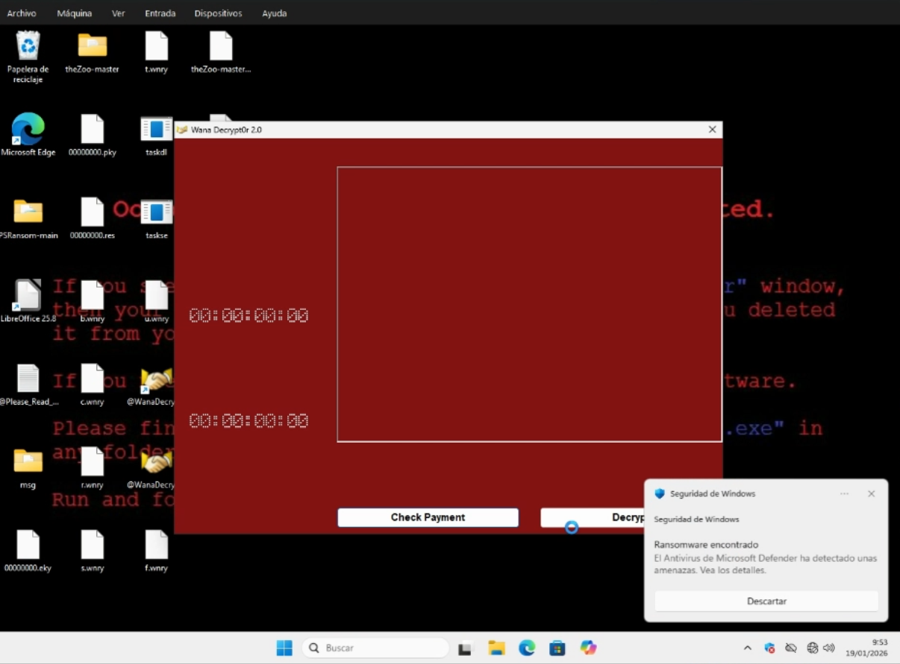
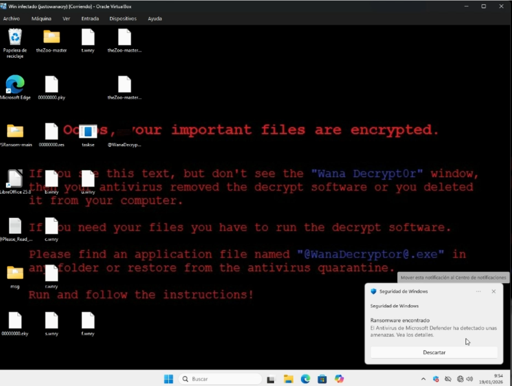

## 7. Restauración del programa de negociación

- Se accedió nuevamente a **Seguridad de Windows**.
- Se entró en el **Historial de protección**.
- Se localizó el archivo eliminado correspondiente a WannaCry.
- Se seleccionó la opción **Restaurar** para recuperar el programa de negociación.

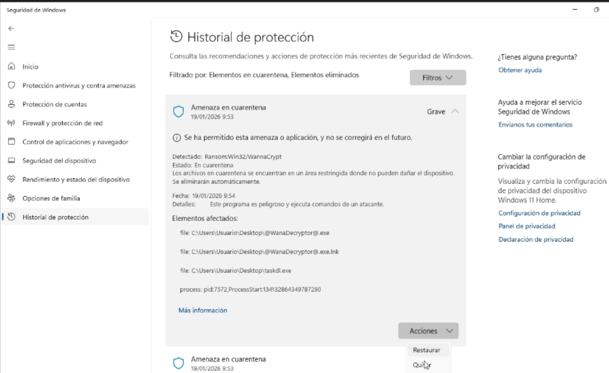

- Tras restaurarlo, se pudo observar:

   * El mensaje de rescate.
   * La interfaz de negociación para liberar el sistema.

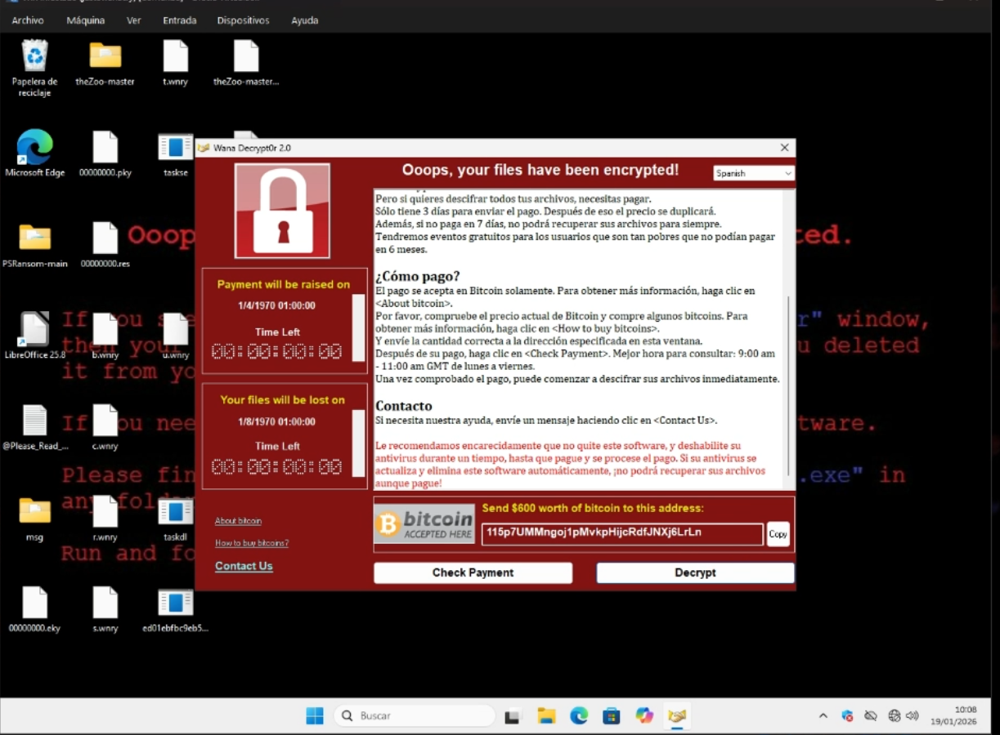

Además, el ransomware cambió el fondo de pantalla del sistema mostrando un mensaje que indica que el malware es consciente de que el antivirus puede haber eliminado la interfaz de negociación.

## 8. Observación de los efectos del ransomware

- Se comprobó qué archivos habían sido cifrados.
- Se observó que el ransomware afecta a determinados tipos de archivos.
- Se documentó el mensaje de rescate mostrado por WannaCry.
- No se realizó ningún intento de pago ni conexión externa.

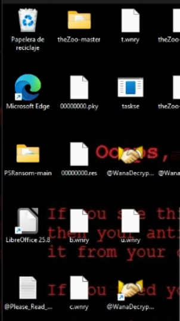

## 9. Restauración del sistema

- Tras finalizar la observación del comportamiento del ransomware, se apagó la máquina virtual.
- Se restauró la instantánea **“Antes del virus”**.
- El sistema volvió a su estado original, completamente limpio y sin infección.

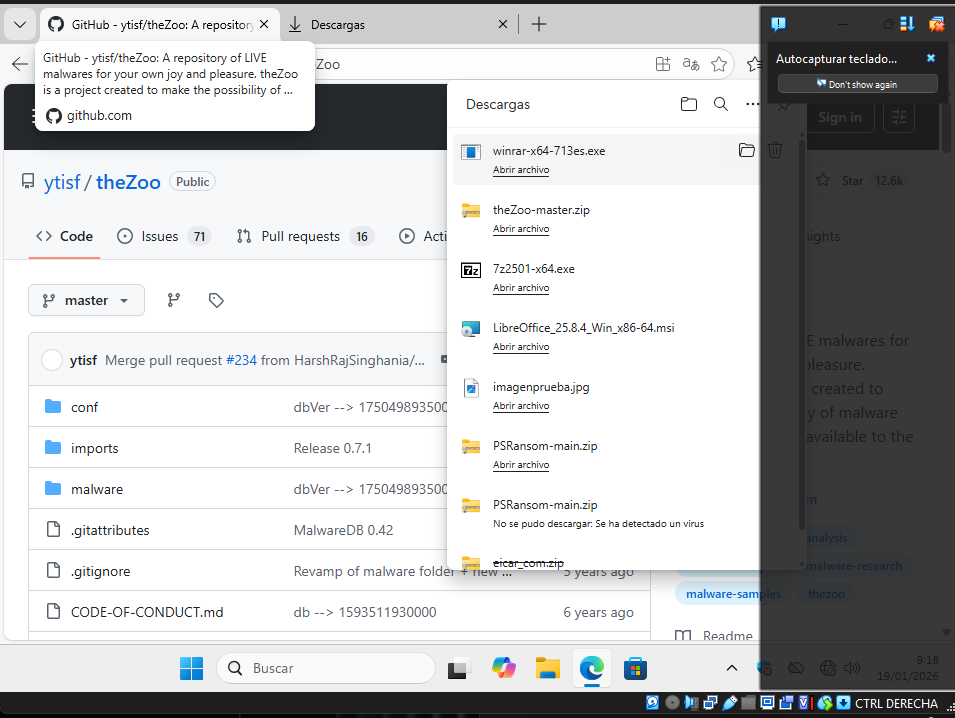

## 10. Conclusión

Esta práctica permite observar de forma controlada el comportamiento real de un ransomware como WannaCry, así como comprobar cómo Windows Defender actúa incluso cuando parte de sus protecciones están desactivadas. La realización de la práctica en una máquina virtual aislada y el uso de instantáneas resulta fundamental para evitar daños permanentes y riesgos de seguridad.

