## 1) Preparación del entorno (VirtualBox)

**Objetivo:** Dejar ambas VMs listas y en red correcta para que OpenVAS pueda escanear Metasploitable 2 y nosotros podamos entrar a la consola web de OpenVAS desde el PC local.

### 1.1. Importamos las VMs

1.  **Nos vamos** a VirtualBox → **Archivo → Importar servicio virtualizado**.
2.  **Clickamos** para seleccionar el `.ova` de **Metasploitable-2** (el que nos facilitaron en la comuna).
3.  **Revisamos** la ruta de importación (donde se guardará la VM) y **damos** a **Importar**.
4.  **Repetimos** el proceso con el `.ova` de **OpenVAS**.

**Nota:** Si descargamos Metasploitable-2 de Internet, a veces viene sólo el disco (`.vmdk`). En ese caso tocaba crear una VM manual y adjuntarlo. Como ya tenemos `.ova` de la comuna, nos ahorramos ese paso.

### 1.2. Red de Metasploitable

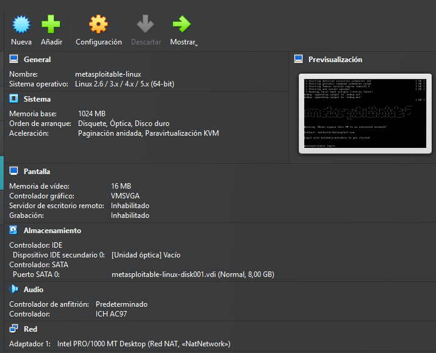

1.  **Seleccionamos** la VM `Metasploitable` → **Configuración** → **Red**.
2.  **Adaptador 1**: **xarxa-NAT** (NAT).
3.  **Aceptamos** y **arrancamos** la VM.
4.  **Credenciales por defecto**:
    *   Usuario: `msfadmin`
    *   Contraseña: `msfadmin`
    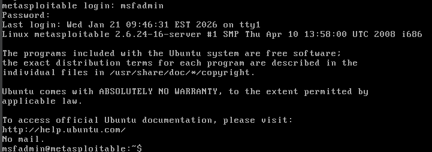

5.  **Abrimos** una terminal y **ejecutamos**:
    ```bash
    ip a
    ```
6.  **Anotamos** la IP (suele ser algo como `10.0.2.7` si está en NAT).

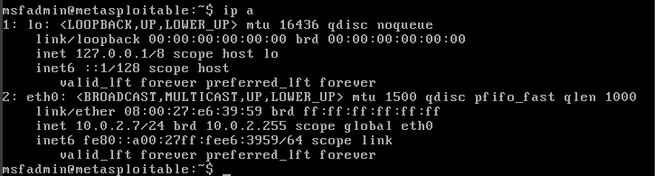

**Tip:** Si no tiene IP, reiniciamos el servicio DHCP o reiniciamos la VM.

### 1.3. Red de OpenVAS (2 NICs)

1.  **Seleccionamos** la VM `OpenVAS` → **Configuración** → **Red**.
2.  **Adaptador 1**: **xarxa-NAT** (NAT).
    *   Propósito: Que OpenVAS actualice el feed y tenga salida a Internet y alcance a Metasploitable via NAT.
3.  **Adaptador 2**: **Host-only** (por ejemplo, `VirtualBox Host-Only Ethernet Adapter`).
    *   Propósito: Acceder a la web de OpenVAS **desde nuestro PC local** sin depender de NAT.
    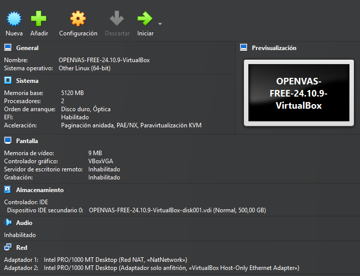
4.  **Arrancamos** la VM OpenVAS.

### 1.4. Inicialización de OpenVAS (en consola de la VM)

1.  En el menú inicial, **saltamos** la licencia (**Skip**).

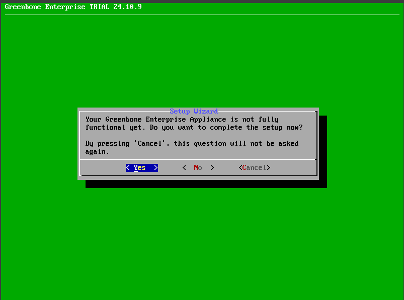

2.  **Creamos** el usuario web:
    *   Usuario: `admin`
    *   Contraseña: `admin`

    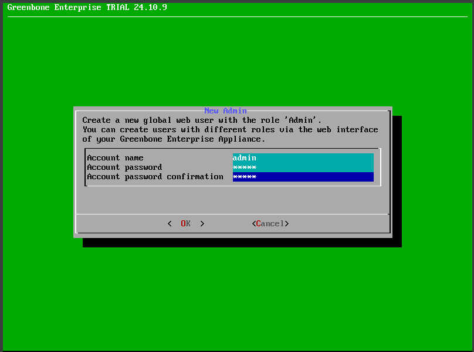

    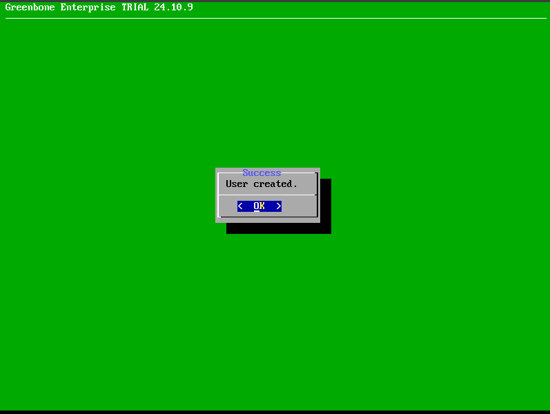

3.  **Configuramos** **ambas** interfaces de red con **IPv4 DHCP** (Adaptador 1 = NAT, Adaptador 2 = Host-only).

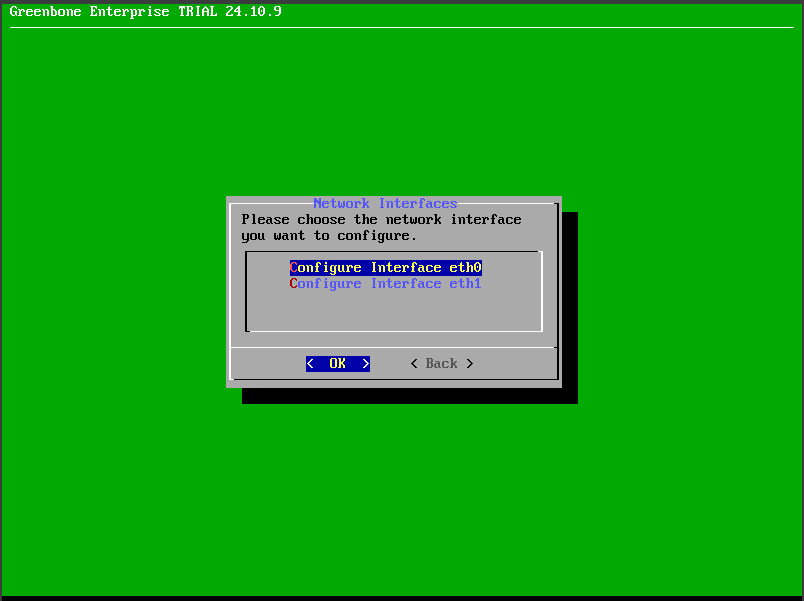

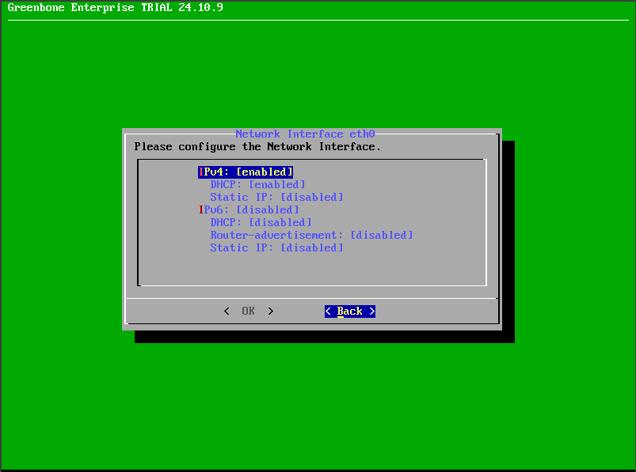

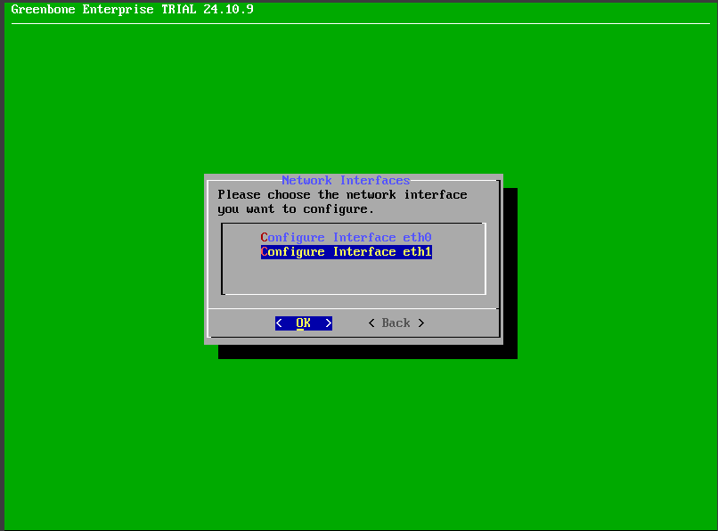

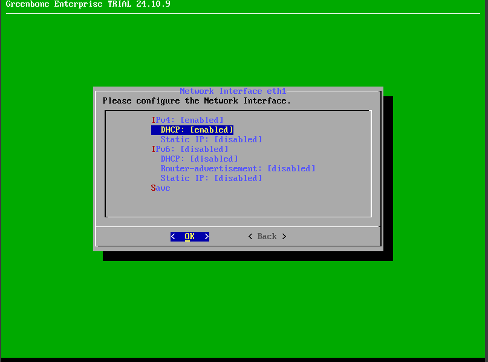
4.  **Anotamos** las **dos IPs** que asigna (una será de la red NAT y la otra de la red Host-only, típicamente `192.168.56.x`).

**Resultado esperado**:

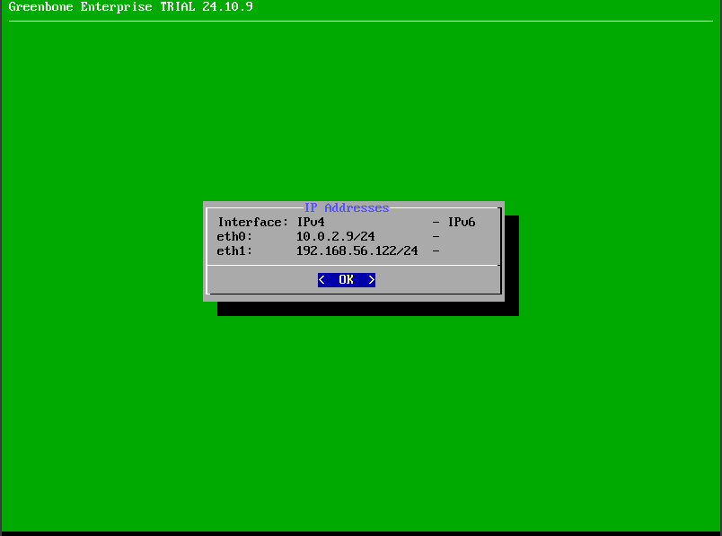


*   IP NAT (OpenVAS): `10.0.2.9`
*   IP Host-only (OpenVAS): `192.168.56.122`


***

## 2) Acceso a la consola web de OpenVAS

1.  **Desde el PC local** (navegador), **nos vamos** a:
        https://<IP_host-only_de_OpenVAS>:9392
    Ej.: `https://192.168.56.122:9392`
2.  **Ignoramos** el aviso del certificado (es autofirmado): **Avanzado → Aceptar riesgo y continuar**.
3.  **Entramos** con:
    *   Usuario: `admin`
    *   Contraseña: `admin`
    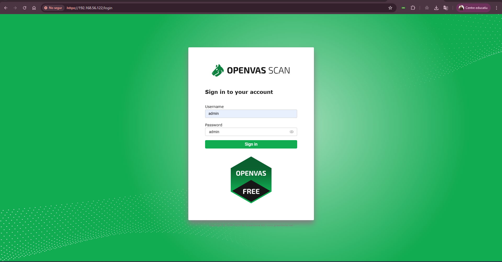
    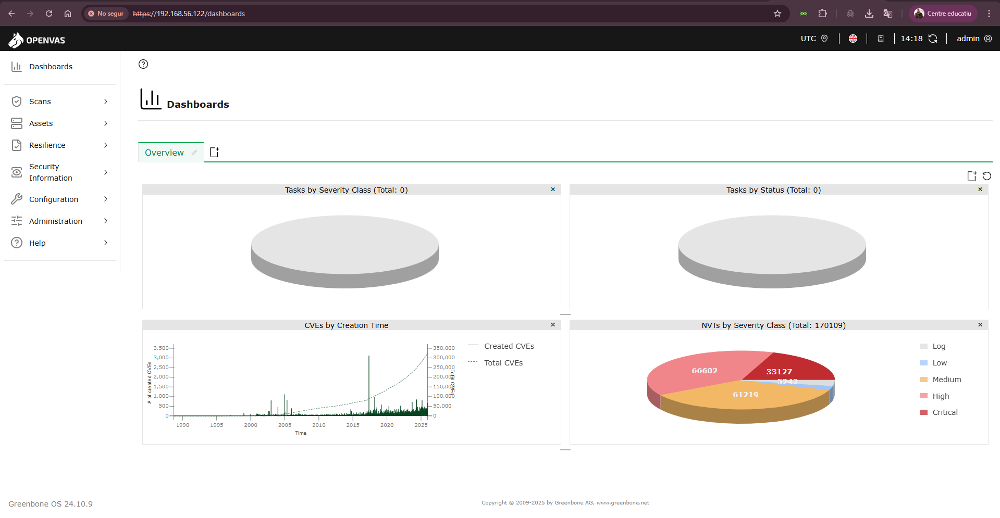


***

## 3) Configuración del objetivo (Target) y credenciales

**Objetivo:** Decirle a OpenVAS qué host escanear y con qué credenciales para SSH/SMB (si aplica).

1.  **Nos vamos** a **Assets → Hosts** → **New Host**.
    *   **Host**: IP de Metasploitable (la apuntada antes de `ip a`).
    *   **Damos** a **Create**.

    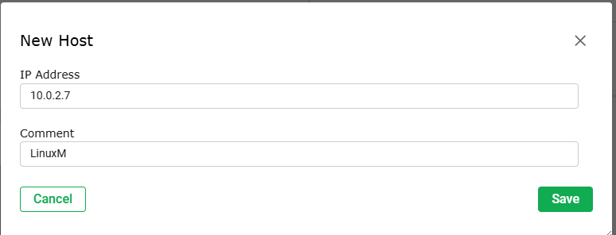
2.  **Nos vamos** a **Configuration → Credentials** → **New Credential** 
    *   **SSH**:
        *   Name ej: `msfadmin-ssh`
        *   Username: `msfadmin`
        *   Authentication: **Password**
        *   Password: `msfadmin`
        *   **Create**
        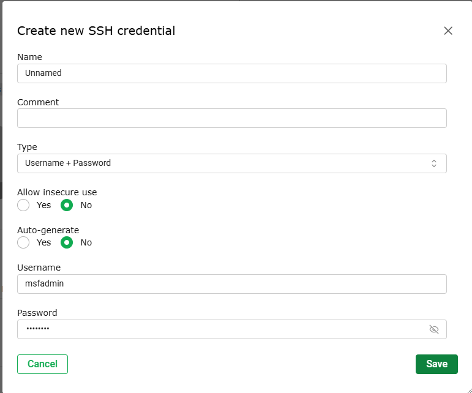

3.  **Nos vamos** a **Assets → Targets** → **New Target**:
    *   **Name ej**: `Linux Vulnerable`
    *   **Hosts**: IP de Metasploitable
    *   **Port List**: `All IANA assigned TCP and UDP` (o la que recomiende el profe)
    *   **SSH Credential**: `msfadmin-ssh` (si queremos un escaneo autenticado básico)
    *   **Create**

***

## 4) Lanzamos el escaneo

1.  **Nos vamos** a **Scans → Tasks** → **New Task**.
    *   **Name ej**: `Linux Vulneraable`
    *   **Target**: `Metasploitable2`
    *   **Scan Config**: `Full and fast` (recomendado para empezar)
    *   **Scanner**: `OpenVAS Default` / `Greenbone Vulnerability Manager` (según versión)
    *   **Create**
    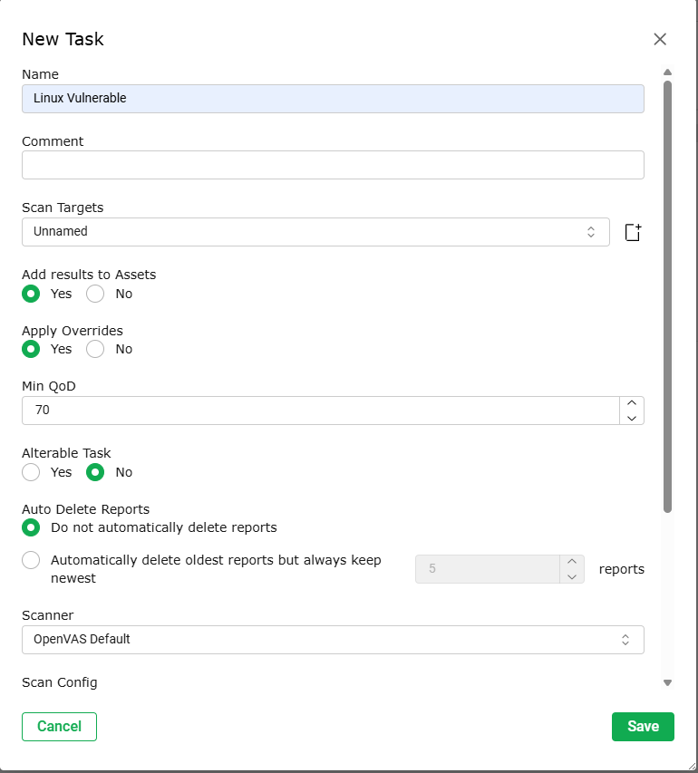
2.  **Damos** a **Start**.

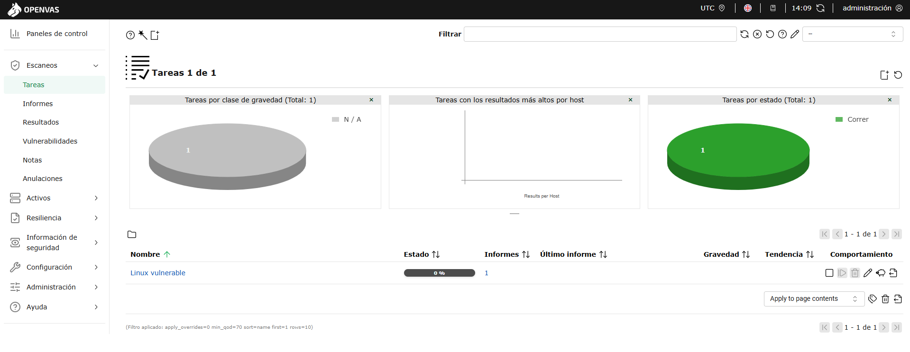

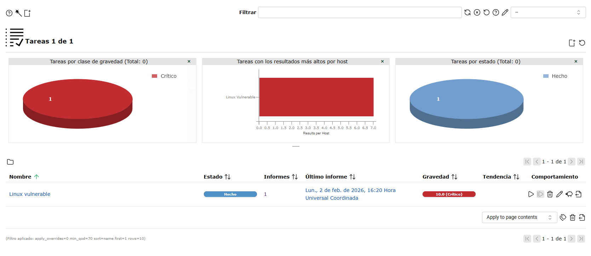

3.  **Esperamos** a que avance el porcentaje. Si **nos queda poco tiempo**, **cancelamos** y **trabajamos con resultados parciales**.


**Tip de rendimiento:** La primera vez puede tardar más si el feed se actualiza. Si vemos mensajes de feed desactualizado, nos vamos a **Administration → Feed** y actualizamos cuando sea posible.

***

## 5) Revisión de resultados

1.  Al completar (o cancelar) el escaneo, **clickamos** en la **Task** → **Report**.
2.  **Vemos**:
    *   **Resumen por severidad** (CVSS / Severity High, Medium, Low)
    *   **Vulnerabilidades por servicio/puerto**
    *   **Detalles**: descripción, impacto, solución, referencias (CVE, NVT, links).

    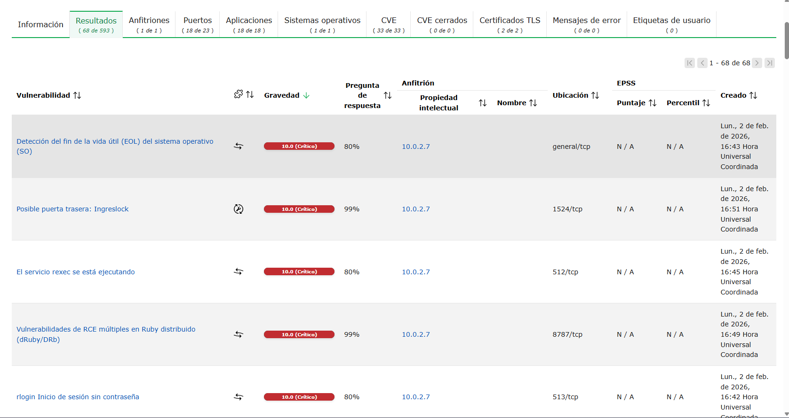

3.  **Exportamos** si queremos: **Download → PDF/HTML/CSV** 

***

## 6) Documentación 

## 1. Vulnerabilidades Analizadas (4 ejemplos)

### 4.1. vsftpd 2.3.4 Backdoor

*   **CVE**: CVE-2011-2523
*   **Severidad**: Alta (RCE)
*   **Descripción**: vsftpd 2.3.4 contiene una puerta trasera que permite obtener shell si el usuario incluye `:)` en el username.
*   **Posible explotación**:
    *   Conectar a FTP (puerto 21), autenticarse con `usuario:)` y disparar shell en el puerto 6200/tcp.
*   **Mitigación**:
    *   Desinstalar vsftpd vulnerable o **actualizar** a una versión segura.
    *   Limitar exposición del puerto 21 (firewall), deshabilitar servicio si no es necesario.

    

### 4.2. ProFTPD mod\_copy (Arbitrary File Copy)

*   **CVE**: CVE-2010-3867
*   **Severidad**: Alta
*   **Descripción**: El módulo `mod_copy` permite copiar archivos arbitrarios en el servidor sin autenticación adecuada.
*   **Posible explotación**:
    *   Copia de `/etc/passwd` o sobrescritura en ubicaciones accesibles vía web para ejecutar código.
*   **Mitigación**:
    *   Deshabilitar `mod_copy` o **actualizar** ProFTPD.
    *   Aplicar reglas de firewall/ACLs; principio de mínimo privilegio.

### 4.3. Samba trans2open (Arbitrary File Access)

*   **CVE**: CVE-2003-0201
*   **Severidad**: Alta
*   **Descripción**: Desbordamiento en Samba (2.2.x) permite ejecución remota de código mediante peticiones malformadas.
*   **Posible explotación**:
    *   Enviar paquetes SMB maliciosos al puerto 139/445 para obtener ejecución con privilegios de `nobody` o peor.
*   **Mitigación**:
    *   **Actualizar** Samba a versión corregida.
    *   Restringir puertos 139/445; segmentación de red; deshabilitar si no se usa.

### 4.4. Apache Tomcat Manager (Credenciales por defecto)

*   **CVE**: CVE-2009-3548 (y relacionados a credenciales por defecto/weak)
*   **Severidad**: Alta
*   **Descripción**: Consola `/manager/html` con credenciales por defecto (`tomcat:tomcat` o similares) permite desplegar WAR y ejecutar código.
*   **Posible explotación**:
    *   Acceder a `http://<IP>:8080/manager/html`, autenticarse con credenciales débiles y subir un WAR malicioso.
*   **Mitigación**:
    *   Cambiar credenciales, deshabilitar manager en producción, **actualizar** Tomcat, restringir acceso por IP.

OTRAS:

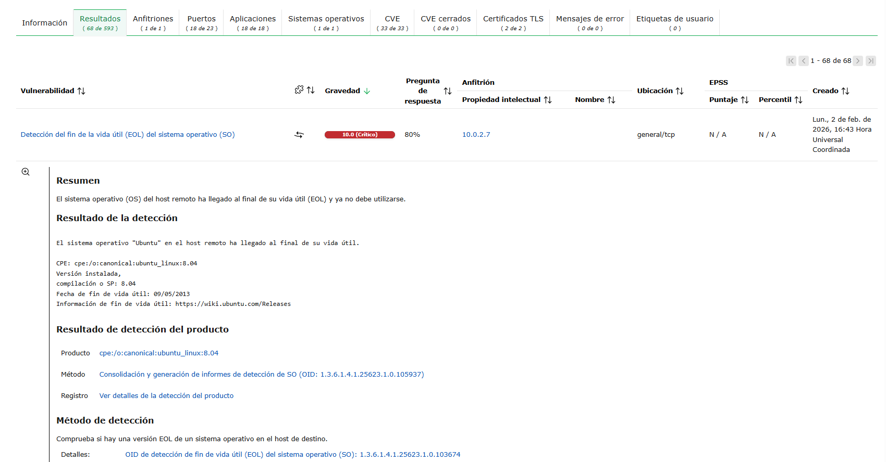

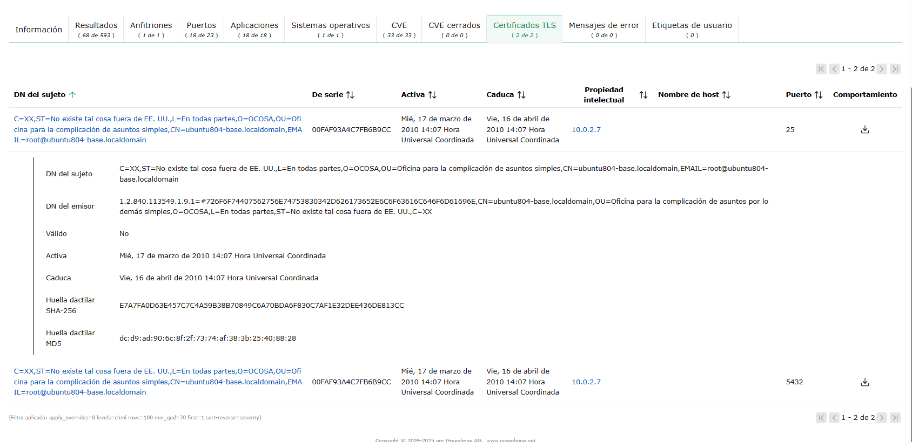

## 5. Medidas Generales de Mitigación

*   **Gestión de parches**: Actualizaciones periódicas (sistema y servicios).
*   **Reducción de superficie**: Desinstalar servicios no usados (FTP, Tomcat Manager, etc.).
*   **Endurecimiento**: Cuentas sin credenciales por defecto, contraseñas robustas, permisos mínimos.
*   **Segmentación/Firewall**: Limitar puertos expuestos; separar redes de gestión y de producción.
*   **Monitorización**: Alertas sobre puertos/servicios inesperados; IDS/IPS donde aplique.

## 6. Conclusión

Hemos configurado el entorno en VirtualBox, accedido a OpenVAS vía web, definido el target con credenciales, ejecutado un escaneo “Full and fast”, y analizado 4 vulnerabilidades críticas en Metasploitable 2 con su explotación posible y mitigaciones propuestas.


